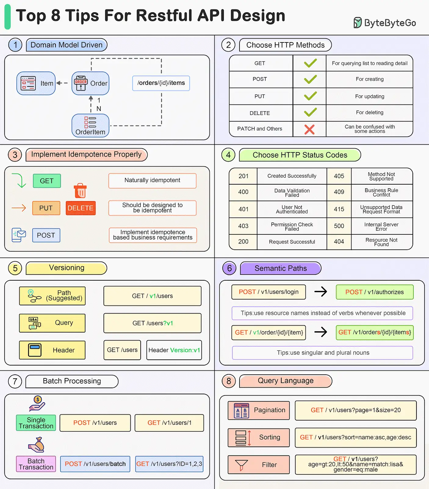

# API Design

## I. Overview

## II. 8 Tips for Restful API Design

- Source: [BBG - YouTube - Top 8 Tips for Restful API Design](https://www.youtube.com/channel/UCZgt6AzoyjslHTC9dz0UoTw/community?lb=Ugkx9RTVVqWA6TDTTaxG391GRtEMSYpDZJ1J)

---

1. Domain Model Design

2. Choose HTTP Methods

3. Implement Idempotence Properly

4. Choose HTTP Status Codes

5. Versioning

6. Semantic Paths

7. Batch Processing

8. Query Language
