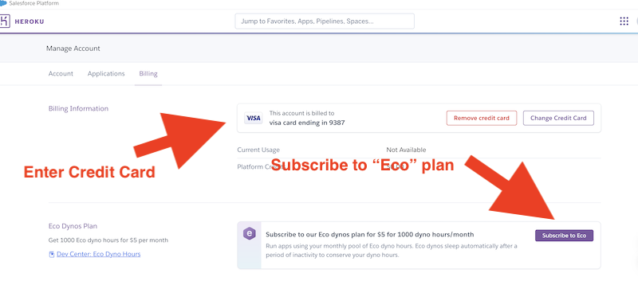

# 1 - Git & Heroku Setup

## I. Where are the Instructions?
- Head to myCourses *Content* Section, *Guides & Links*, and download the "Git & Heroku Setup" DOC - it consists of the following sections:
  - Setting Up Github/Creating a GitHub Account
  - Using Git
  - Setting up Heroku
 
---
 
## II. Creating a GitHub Account (pages 1-3)
- You should already have an educational GitHub account
  - if not, follow the instructions on page 3

---

## III. Using Git (pages 4-14)
- Follow the instructions in "Using Git Part I" - you will be:
  - Forking the respository
  - Cloning the repository to your local machine (BTW don't use Powershell - instead you should use GitBash either by itself or in concert with VSCode)
  - Make changes, then push them to ***your fork of the repository***
- ***Go ahead and SKIP "Using Git Part II" (making a pull request)***

---

## IV. Setting Up Heroku (page 20-23)
- Follow the instructions to set up a Heroku account and receive the educational credits
  - after you get the confirmation email, and can see the platform credits, you can enter your credit card # and choose a plan ...
  - ... and be sure to pick the *Eco Dyno*!

---

## V. Submission (page 24)
- You don't need to submit anything to myCourses
