# 10 - `POST`ing data to express

- We have seen how to pass data to an express app with `GET` via URL params and URL routes ...
- now let's see how to send data to express via `POST`

---

## I. Create the GET `/api/hoots` endpoint

- `/api/hoots` will be an endpoint where we can play around with the `GET`, `POST`,`DELETE` and `PATCH` HTTP methods
- "hoots" will be short declamations or interjections, such as "Yay! Free lunch is good" or "Hmm... Birds aren't real!"
- Here's the code for our array of `hoots` - it has a single default hoot - add this code to  **routes/api.js**:

```js
const generateNewId = () => crypto.randomUUID();

const hoots = [{
  id: generateNewId(),
  content: "Let's Rock!",
  createdAt: new Date(),
}];
```

- ***\*\* YOU TRY THIS \*\**** --> Now add a `GET` route to **routes/api.js** that will display all of the `hoots` as JSON - it will be available at **/api/hoots**

<details>
  <summary><b>Solution for <kbd>/api/hoots</kbd> in routes/api.js</b></summary>
  <code>
   router.get('/hoots', (req, res) => {
    res.json(hoots);
   });
  </code>
</details>

---

- Test it at: http://localhost:3000/api/hoots - you should see the contents of the `hoots` array - as JSON
  
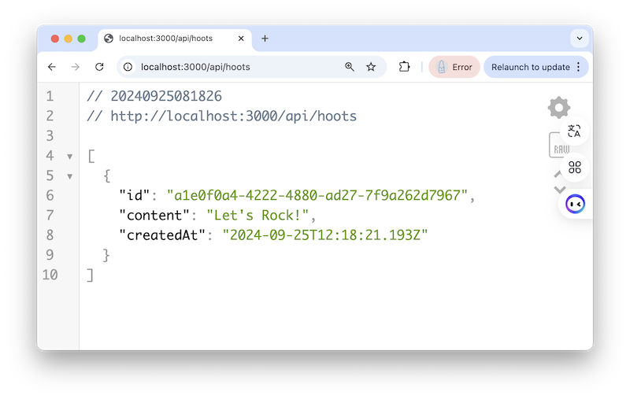

---

## II. Create the POST `/api/addHoot` endpoint
- `POST`ing in HTTP is for when we want to send data to the server - for example a new Hoot!
- To get started, add the following to **routes/api.js**:

```js
router.post('/addHoot', (req, res) => {
  const test = {
    testId: generateNewId(),
    testMsg: 'POST /api/addHoot - test',
  };
  res.json(test);
});
```

---

- If you head to http://localhost:3000/api/addHoot in the browser you'll be calling a `GET` endpoint that does not exist
  
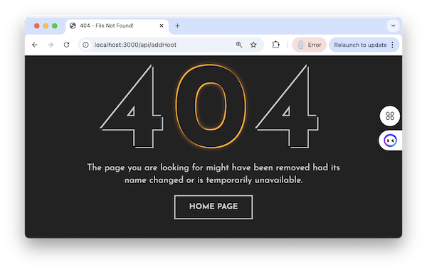

---


- To properly test this `POST` endpoint, go ahead and use Postman to connect to http://localhost:3000/api/addHoot - and don't forget to set the method to `POST`
- Did you forget how to use Postman with `POST` requests? See --> [Week 2 - Read/Update/Delete with json-server](5-read-update-delete-json-server.md#iii-get--post-endpoints)
- If everything is working you should see something like this in the response body (although the `id` will be different everytime this is called):

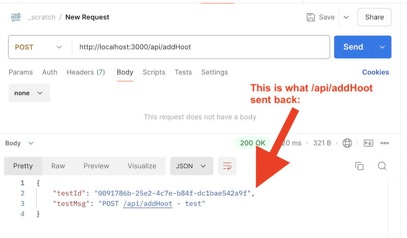

---

- This `POST` `/addHost` endpoint isn't doing much yet:
  - it's *returning* some data
  - but not *accepting* any data
- So let's move on!

---

### II-A. Accessing `POST` data sent by the client
- Let's move on and add code that accepts data that is sent along with the `POST` request
- `request.body` is a property that contains any `POST` data that is sent with a `POST` request
- First make the two changes below in the `POST` `/api/addHoot` route:

```js
router.post('/addHoot', (req, res) => {
  console.log('req.body=', req.body); // NEW!
  const test = {
    testId: generateNewId(),
    testMsg: req.body.content, // NEW!
  };
  res.json(test);
});
```

- Over in **app.js** - you just need to add this one line of code, that tells express to handle `POST` JSON data:

```js
// put this right after the other `app.use()` call
app.use(express.json());
```

---

- In Postman, send a `POST` request to `http://localhost:3000/api/addHoot`
  - in the request body, make it type "raw" and JSON
  - here's the JSON you can send: `{ "content" : "This is a new Hoot!" }`
 
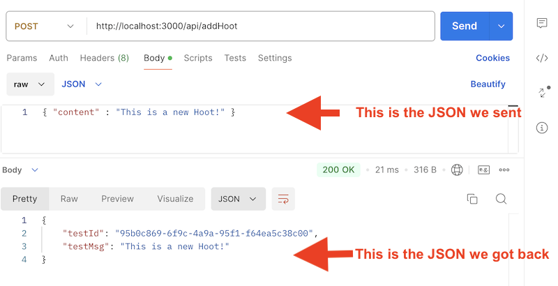

---

- Check the Node console - it will log:

```
req.body= { content: 'This is a new Hoot!' }`
```

- If we change the log to `console.log('req.body.content=', req.body.content);` we will instead see:

```
req.body.content= This is a new Hoot!
```

- Meaning that express is taking that string content that's coming over the `POST` request, and `JSON.parse()`ing it into an object for us!

---

### II-B. Adding `POST` data to the `hoots` array 


- Here's your new version of POST `/api/addHoot` (replace the old version with this one):

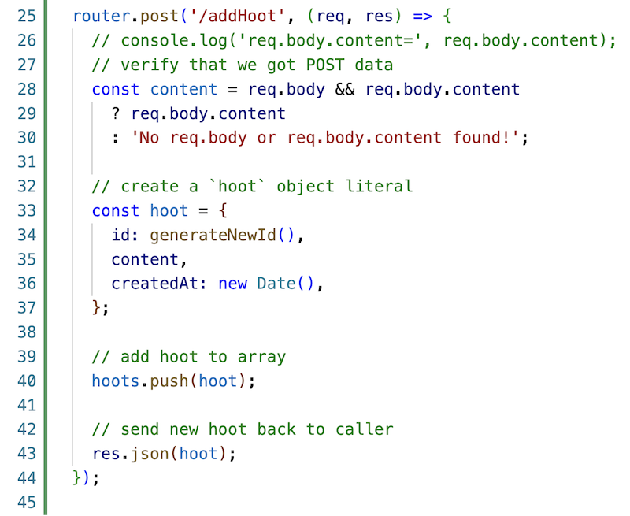

---

- In Postman, head to http://localhost:3000/api/addHoot and send the same request we did last time:
  - the one with the `{ "content" : "This is a new Hoot!" }` data

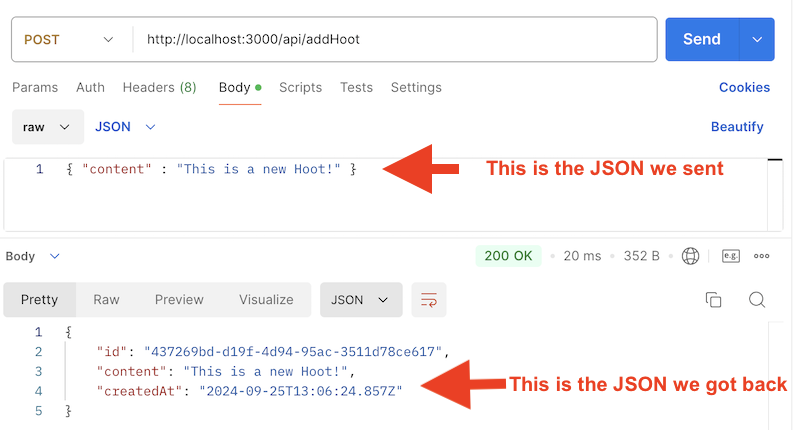

---

- In a browser, head to http://localhost:3000/api/hoots to see that the new hoot has been added to the array:

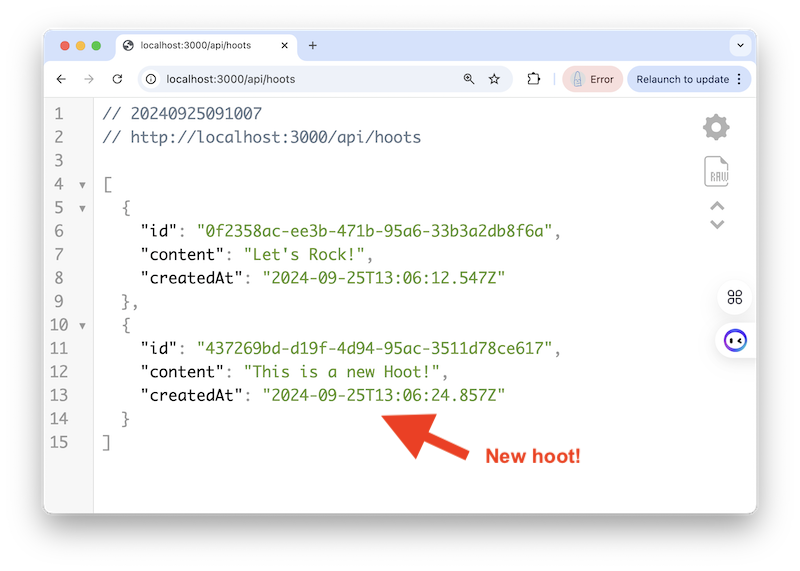

- If you head back to Postman and click the Send button a few more times, and then reload http://localhost:3000/api/hoots in the browser, you will see that more hoots have been added, each with a unique `id` value

---

- ***Oops! One little update to the code above - you may have already caught it - here we should be sending back an HTTP status code of `201 Created`, NOT `200 Ok`***
  - it's an easy fix! Change `res.json(hoot)` to `res.status(201).json(hoot);`
  - test it again in Postman to confirm you can see the `201` status code

--- 

## III. admin.html - "view all hoots"

- How about an HTML `<form>` for viewing hoots, adding hoots, editing, hoot, deleting hoots etc?
- Here's the HTML & JS for viewing hoots
- The file is named **admin.html** - put this in the **client/** folder

**admin.html**

```html
<!DOCTYPE html>
<html lang="en">
<head>
  <meta charset="UTF-8">
  <meta name="viewport" content="width=device-width, initial-scale=1.0">
  <title>Admin Page!</title>
  <style>
    h1,h2{
      font-family: 'Gill Sans', 'Gill Sans MT', Calibri, 'Trebuchet MS', sans-serif;
    }
    #output-new-hoot{ 
      border:1px solid gray;
      width: 620px;
    }
  </style>
</head>
<body>
<h1>Admin Page</h1>
<hr>
<h2>I. See all the hoots!</h2>
<p><button id="btn-all-hoots">Fetch <kbd>/api/hoots</kbd></button></p>
<h3>Results:</h3>
<div id="output-all-hoots">???</div>

<hr>

<h2>II. Add a hoot!</h2>
<form id="form-add-hoot">
  <label>Content: <input type="text" name="content" size="80"></label><br><br>
  <button type="submit">Send POST Request to <kbd>/api/addHoot</kbd></button>
</form>
<h3>Results:</h3>
<div id="output-new-hoot">???</div>

<hr>

<h2>III. Delete a hoot!</h2>
<form id="form-delete-hoot">
  <label>Id: <input type="text" name="hoot-id" size="36"></label><br><br>
  <button type="submit">Send DELETE Request to <kbd>/api/deleteHoot</kbd></button>
</form>

<div id="output-delete-hoot">???</div>

<hr>

<h2>IV. Edit a hoot!</h2>
<form id="form-edit-hoot">
  <label>Id: <input type="text" name="hoot-id" size="36"></label><br>
  <label>New content: <input type="text" name="content" size="80"></label><br><br>
  <button type="submit">Send PUT Request to <kbd>/api/updateHoot/</kbd></button>
</form>

<div id="output-edit-hoot">???</div>

<hr>

</body>
<script>
const getJsonFetch = async (url, callback) => {
  let json;
  try{
    const response = await fetch(url,{
      method: 'GET',
      headers: {
        'Accept': 'application/json'
      }
    });
    json = await response.json();
  }
  catch(error){
    console.log('ERROR:', error);
    json = {author: `Can't parse data file '${url}'`};
  }
  callback(json);
};

/* GET All Hoots */
const allHootsCB = selector => {
  const element = document.querySelector(selector);
  return json => element.innerHTML = json.map(
    h => `<p>
            "${h.content}" - 
            <b>id:</b> ${h.id} - 
            <b>created:</b> ${h.createdAt}
          </p>`
  ).join('');
};

const btnAllHoots = document.querySelector('#btn-all-hoots');
const allHootsURL = '/api/hoots';
btnAllHoots.onclick = () => {
  getJsonFetch(allHootsURL, allHootsCB('#output-all-hoots'));
};

</script>
</html>
```

- Head to http://localhost:3000/admin.html - the button for viewing all hoots should work with no issues!
- The 2nd button, "Add a Hoot" does not work, and reloads the HTML page when it's clicked:
  - let's handle that one next!

---

## IV. admin.html - "add a hoot"

- The `POST `/api/addHoot` endpoint is already working - we tested that with Postman, above
- Now we just need an HTML form to call the endpoint


---

- First, here's the POST request helper function we'll need - start typing!
  - note that `postJsonFetch()` has a parameter we have not seen before `payload`
    - this is the data we want to send along with the `POST` request, as a file
  - you can see that in the fetch() request, thie payload is getting stringified and sent along as the `body` of the `POST` request
  - the other new thing we are doing is to send the HTTP status code back with the callback function, along with the JSON

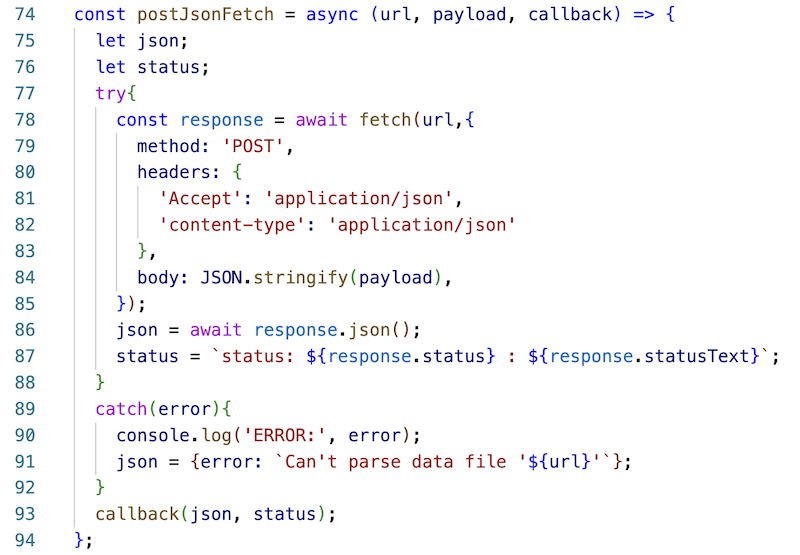

---

- Here's the rest of the code - keep typing!
- Note the function declared on line 117, that's the `callback(json,status)` function that will be called from `postJsonFetch()`
  - BTW: it's a function that was declared inside a function, aka a *closure*. We did this so that we could access the `selector` parameter later on, after the data was loaded
  - we did the same thing in `allHootsCB()`

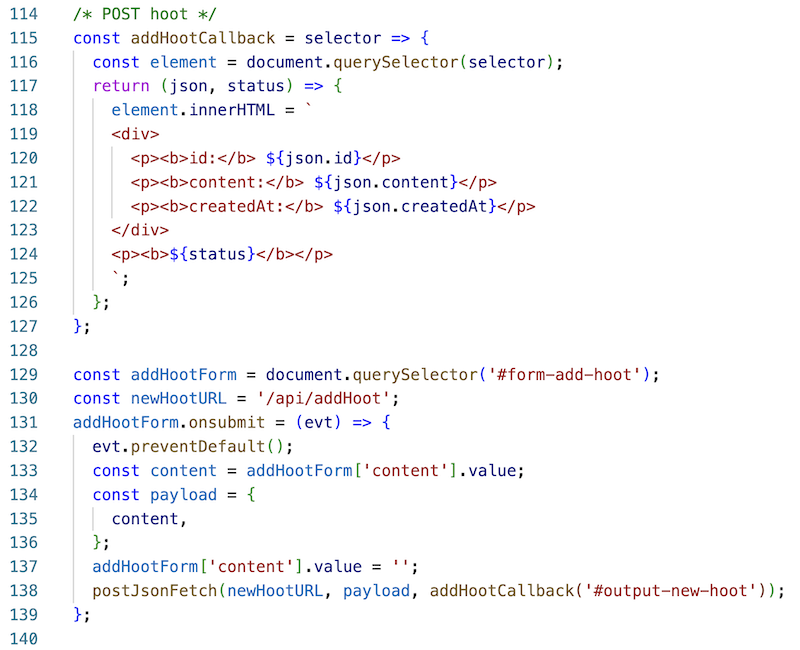

---

## V. "Delete a hoot" server endpoint

- Let's build the server endpoint first - `DELETE` `/api/deleteHoot/:id`
- Add the following to **routes/api.js**:

---

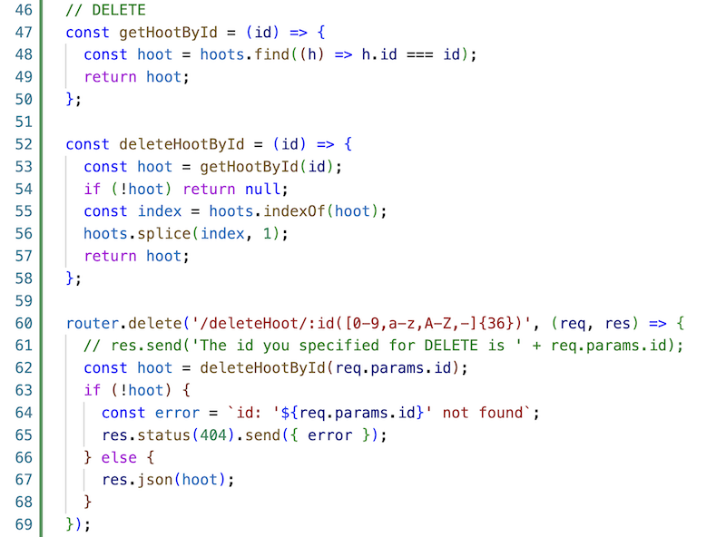

---

- Let's talk about the code above:
- `getHootById(id)` is a helper function that returns a hoot with a matching `id`, or `undefined` if no match is found
  - we made this a (reusable) function because you can also utilize it elsewhere for finding and returning a specific quote, or finding and editing a specific quote, etc ...
  - BTW you could shorten whis to a "one-liner" if you want to
- `deleteHootById()` is also some code that could potentially be re-used, for example if we wanted to delete a bunch of hoots at the same time (a "batch" delete)
- `router.delete('/deleteHoot/:id([0-9,a-z,A-Z,-]{36})', ...`
  - ***above we gave you that regular expression you could copy!***
  - this route will only be called if a 36-character long `id` with the allowed characters is passed in
  - it then searches for a matching hoot:
    - if it finds it, that hoot is deleted, and then a copy of the hoot is returned via the HTTP response. The `200 Ok` status code is returned.
    - if not, a `404` response is returned

---

- Test this from Postman:
  - `DELETE http://localhost:3000/api/deleteHoot/a-valid-36-character-id`
    - will DELETE that hoot - check http://localhost:3000/api/hoots to confirm
  - `DELETE http://localhost:3000/api/deleteHoot/an-invalid-36-character-id`
    - FAILS - a short `404` error message
  - `DELETE http://localhost:3000/api/deleteHoot/12345`
    - FAILS - you get the full `404` page back and the array is untouched
- Below is a successful `DELETE`

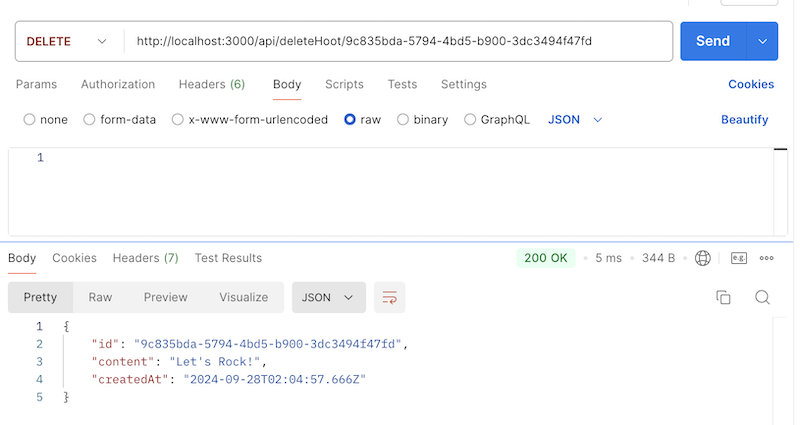
  
---

## VI. admin.html - "Delete a hoot" `<form>`


- Here's the code!
  - if you look carefully, you can see that we're reusing `addHootCallback()`, but giving it a different `<div>` to update

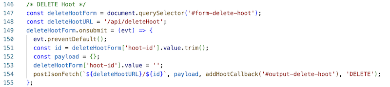

---

- If you run the above code now, you'll get an error, because we are also re-using `postJsonFetch()` - and passing it a 4th parameter - `DELETE`
- We need to update the `postJsonFetch()` code to utilize this new parameter, and without breaking the previous `POST` code that is using the function
- See the 2 changes in the screnshot below:

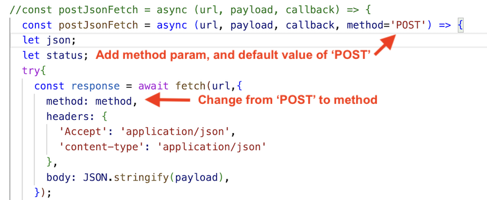

---

- ***Now test it - a successful delete will return the hoot that was just deleted, AND clicking the "Show all Hoots" button will verify that the hoot has been deleted***

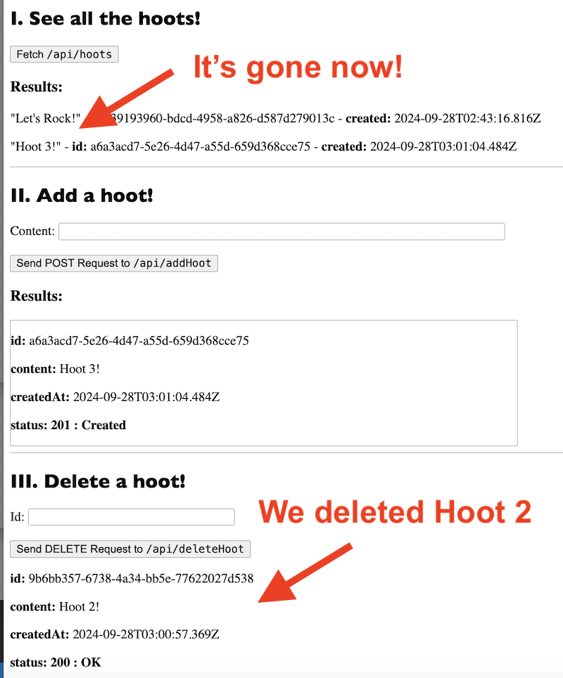

- ***BTW - sending over a nonexistent 36-characte id (i.e. an invalid id) will show a "Status 404". Sending a malformed id will show "undefined" for status - that's how we wrote our server code, so that's OK for now.***

---

## VII. "Edit a hoot" server endpoint

---

## VIII. admin.html - Edit a hoot `<form>`


---

## XX. Reference
- https://www.digitalocean.com/community/tutorials/use-expressjs-to-get-url-and-post-parameters#step-5-using-req-body-with-post-parameters


---
---

| <-- Previous Unit | Home | Next Unit -->
| --- | --- | --- 
| [**9 - Putting our project on Heroku**](9-putting-project-on-heroku.md)  |  [**IGME-430**](../) | 11 - More POSTing
