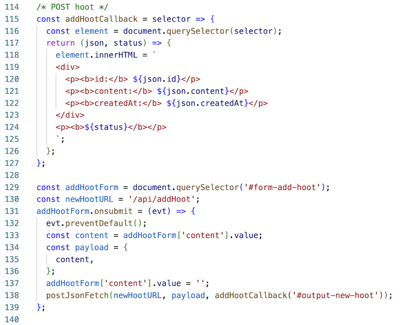

# 11 - Creating admin.html
- How about an HTML `<form>` for viewing hoots, adding hoots, editing hoots, deleting hoots etc?
- Over the next several parts to this exercise, we will implement an "admin" page that will allow the user to:
  - **C**reate (`POST`) hoots
  - **R**ead (`GET`) hoots
  - **E**dit (`PUT`) hoots
  - **D**elete (`DELETE`) hoots

---

## I. Creating admin.html - "view all hoots"


- Here's the HTML & JS for viewing hoots
- The file is named **admin.html** - put this in the **client/** folder

**admin.html**

```html
<!DOCTYPE html>
<html lang="en">
<head>
  <meta charset="UTF-8">
  <meta name="viewport" content="width=device-width, initial-scale=1.0">
  <title>Admin Page!</title>
  <style>
    h1,h2{
      font-family: 'Gill Sans', 'Gill Sans MT', Calibri, 'Trebuchet MS', sans-serif;
    }
    #output-new-hoot{ 
      border:1px solid gray;
      width: 620px;
    }
  </style>
</head>
<body>
<h1>Admin Page</h1>
<hr>
<h2>I. See all the hoots!</h2>
<p><button id="btn-all-hoots">Fetch <kbd>/api/hoots</kbd></button></p>
<h3>Results:</h3>
<div id="output-all-hoots">???</div>

<hr>

<h2>II. Add a hoot!</h2>
<form id="form-add-hoot">
  <label>Content: <input type="text" name="content" size="80"></label><br><br>
  <button type="submit">Send POST Request to <kbd>/api/addHoot</kbd></button>
</form>
<h3>Results:</h3>
<div id="output-new-hoot">???</div>

<hr>

<h2>III. Delete a hoot!</h2>
<form id="form-delete-hoot">
  <label>Id: <input type="text" name="hoot-id" size="36"></label><br><br>
  <button type="submit">Send DELETE Request to <kbd>/api/deleteHoot</kbd></button>
</form>

<div id="output-delete-hoot">???</div>

<hr>

<h2>IV. Edit a hoot!</h2>
<form id="form-edit-hoot">
  <label>Id: <input type="text" name="hoot-id" size="36"></label><br>
  <label>New content: <input type="text" name="content" size="80"></label><br><br>
  <button type="submit">Send PUT Request to <kbd>/api/updateHoot/</kbd></button>
</form>

<div id="output-edit-hoot">???</div>

<hr>

</body>
<script>
const getJsonFetch = async (url, callback) => {
  let json;
  try{
    const response = await fetch(url,{
      method: 'GET',
      headers: {
        'Accept': 'application/json'
      }
    });
    json = await response.json();
  }
  catch(error){
    console.log('ERROR:', error);
    json = {author: `Can't parse data file '${url}'`};
  }
  callback(json);
};

/* GET All Hoots */
const allHootsCB = selector => {
  const element = document.querySelector(selector);
  return json => element.innerHTML = json.map(
    h => `<p>
            "${h.content}" - 
            <b>id:</b> ${h.id} - 
            <b>created:</b> ${h.createdAt}
          </p>`
  ).join('');
};

const btnAllHoots = document.querySelector('#btn-all-hoots');
const allHootsURL = '/api/hoots';
btnAllHoots.onclick = () => {
  getJsonFetch(allHootsURL, allHootsCB('#output-all-hoots'));
};

</script>
</html>
```

- Head to http://localhost:3000/admin.html - the button for viewing all hoots should work with no issues!
- The 2nd button, "Add a Hoot" does not work, and reloads the HTML page when it's clicked:
  - let's handle that one next!

---

## II. admin.html - "add a hoot"

- The `POST` `/api/addHoot` endpoint is already working - we tested that endpoint with Postman, last time
- Now we just need an HTML form to call this endpoint

---

- First, here's the `POST` request helper function we'll need - start typing!
  - note that `postJsonFetch()` has a parameter we have not seen before  - `payload`
    - this is the data we want to send along with the `POST` request, as a file
  - you can see that in the `fetch()` request, this payload is getting *stringified* and sent along as the `body` of the `POST` request
  - the other new thing we are doing in this helper function is to send the HTTP status code back with the callback function, along with the JSON


---

- Here's the rest of the code - keep typing!
- Note the function declared on line 117, that's the `callback(json,status)` function that will be called from `postJsonFetch()`
  - BTW: it's a function that was declared inside a function, aka a *closure*
  - we did this so that we could access the `selector` parameter later on, after the data was loaded
  - we did the same thing in `allHootsCB()`



---

## III. Test it

- ***Go ahead and test the form by adding a hoot, and then clicking the "See all the hoots!" button to verify that the hoot has been added:***


---

## IV. Wrap up
- We continue to build out and test these server capabilities *first* -  *"server first"* -  before we write any client code ...
- Move on to the next section!


---
---

| <-- Previous Unit | Home | Next Unit -->
| --- | --- | --- 
| [**10 - `POST`ing data to express**](10-express-posting-data.md)  |  [**IGME-430**](../) | [**12 - Delete a hoot**](12-delete-hoot-server-client.md)

