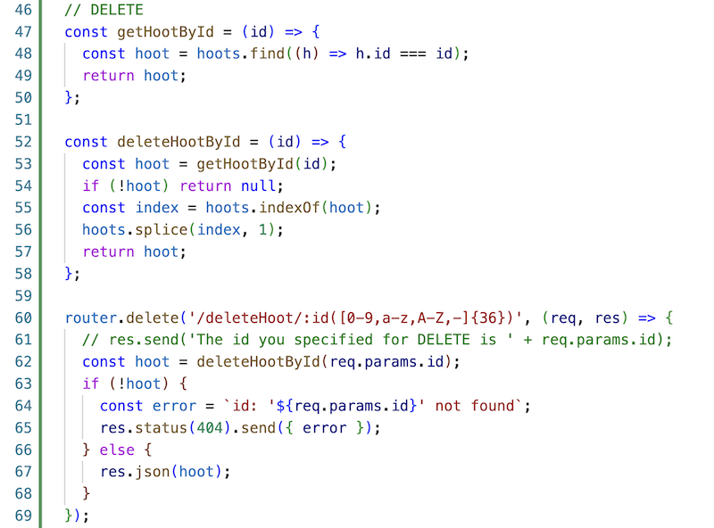
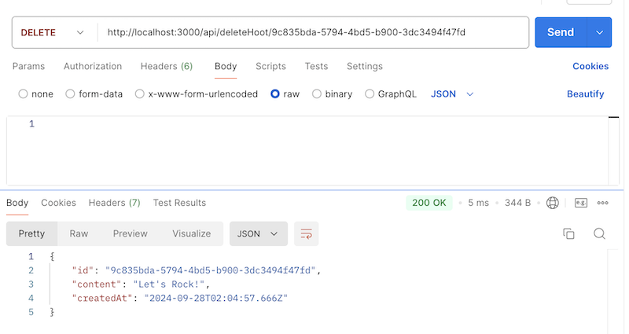
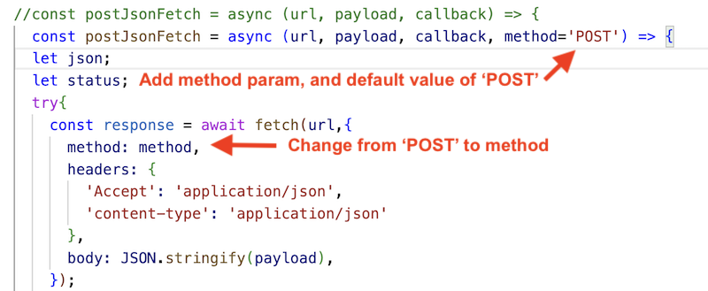

# 12 - Delete a hoot

## I. "`DELETE` a hoot" server endpoint

- Let's build the server endpoint first - `DELETE` `/api/deleteHoot/:id`
- Add the following to **routes/api.js**:

---

---

- Let's talk about the code above:
- `getHootById(id)` is a helper function that returns a hoot with a matching `id`, or `undefined` if no match is found
  - we made this a (reusable) function because you can also utilize it elsewhere for finding and returning a specific quote, or finding and editing a specific quote, etc ...
  - BTW you could shorten whis to a "one-liner" if you want to
- `deleteHootById()` is also some code that could potentially be re-used, for example if we wanted to delete a bunch of hoots at the same time (a "batch" delete)
- `router.delete('/deleteHoot/:id([0-9,a-z,A-Z,-]{36})', ...`
  - ***above we gave you that regular expression you could copy!***
  - this route will only be called if a 36-character long `id` with the allowed characters is passed in
  - it then searches for a matching hoot:
    - if it finds it, that hoot is deleted, and then a copy of the hoot is returned via the HTTP response. The `200 Ok` status code is returned.
    - if not, a `404` response is returned

---

- Test this from Postman:
  - `DELETE http://localhost:3000/api/deleteHoot/a-valid-36-character-id`
    - will DELETE that hoot - check http://localhost:3000/api/hoots to confirm
  - `DELETE http://localhost:3000/api/deleteHoot/an-invalid-36-character-id`
    - FAILS - a short `404` error message
  - `DELETE http://localhost:3000/api/deleteHoot/12345`
    - FAILS - you get the full `404` page back and the array is untouched
- Below is a successful `DELETE`

  
---

## II. admin.html - "Delete a hoot" `<form>`

- Here's the code!
  - if you look carefully, you can see that we're reusing `addHootCallback()`, but giving it a different `
` to update

---

- If you run the above code now, you'll get an error, because we are also re-using `postJsonFetch()` - and passing it a 4th parameter - `DELETE`
- We need to update the `postJsonFetch()` code to utilize this new parameter, and without breaking the previous `POST` code that is using the function
- See the 2 changes in the screnshot below:

---

- ***Now test it - a successful delete will return the hoot that was just deleted, AND clicking the "Show all Hoots" button will verify that the hoot has been deleted***

- ***BTW - sending over a nonexistent 36-character `id` (i.e. an invalid `id`) will show a "Status 404". Sending a malformed id (meaning, not 36-characters) will show "undefined" for status - that's how we wrote our server code, so that's OK for now.***

---

---

---
---

| <-- Previous Unit | Home | Next Unit -->
| --- | --- | --- 
| [**11 - Creating admin.html**](11-post-admin-page.md)  |  [**IGME-430**](../) | [**12 - Delete a hoot**](12-delete-hoot-server-client.md)
