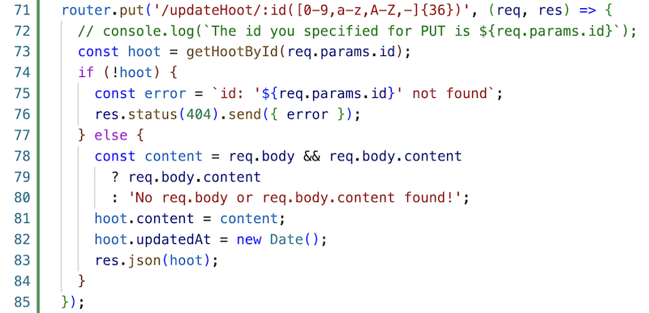
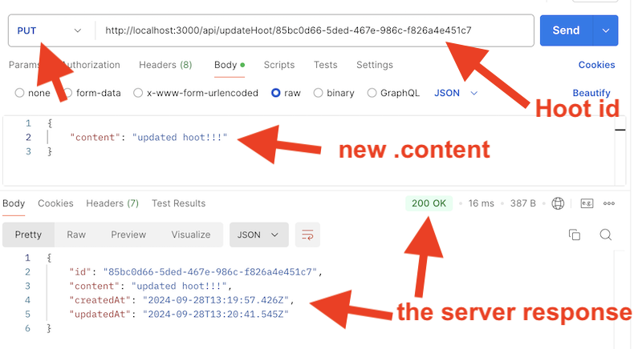
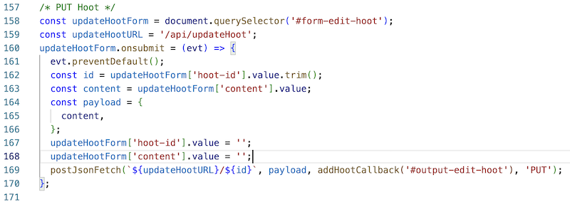
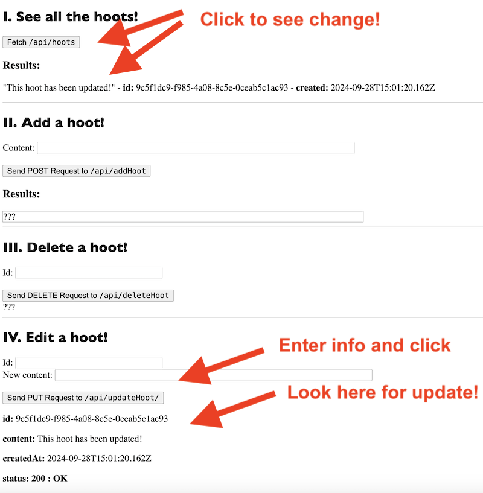

# 13 - Edit (`PUT`) a hoot 

## I. "Edit a hoot" server endpoint

- Here it is - this is a `PUT` operation - how does it work?
  - the code starts out similar to our `/api/deleteHoot/:id` endpoint in that we will first look for an existing hoot ... and if we can't find the hoot we send back a `404`
  - but if we DO find the hoot, rather than deleting it, we'll updated its `.content` property and add an `.updatedAt` property
  - then we have the server respond with the contents of the updated hoot and a `200 Ok` status message

---

- Go ahead and test it with Postman:
 - the hoot `id` goes in the URL
 - the updated content goes in the body
 - see below:

   

---

## II. admin.html - Edit a hoot `<form>`

- Here's the code:

---

- ***Test it in the browser***

---
---

| <-- Previous Unit | Home | Next Unit -->
| --- | --- | --- 
| [**12 - `DELETE` at hoot**](12-delete-hoot-server-client.md)  |  [**IGME-430**](../) | TBA

