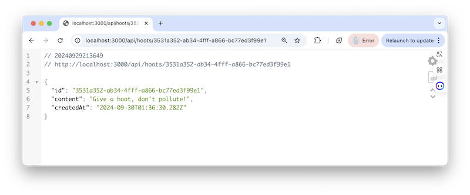
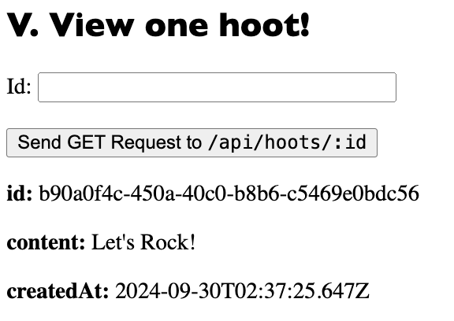

# 14 - Finish up the hoot admin page

## I. Create "View a single hoot" server GET endpoint 
- Endpoint in **api.js** is  `'/hoots/:id([0-9,a-z,A-Z,-]{36})'`
- Test it (either in the browser, or with Postman) with `http://localhost:3000/api/hoots/<valid-hoot-id>`



---

- Also test it with a non-existent id that is 36-characters long
  - http://localhost:3000/api/hoots/11111111-2222-3333-4444-555555555555
  - you'll get this response:

```json
{
  "error": "id: '11111111-2222-3333-4444-555555555555' not found"
}
```
- Test it with a bad `id` - http://localhost:3000/api/hoots/12345 - and you'll get the regular `404` page

---

## II. admin.html - View a single hoot `<form>`

- Here's the HTML:

```html
<hr>
<h2>V. View one hoot!</h2>
<form id="form-view-hoot">
  <label>Id: <input type="text" name="hoot-id" size="36"></label><br><br>
  <button type="submit">Send GET Request to <kbd>/api/hoots/:id</kbd></button>
</form>

<div id="output-view-hoot">???</div>
```

---

## III. admin.html - View a single hoot JavaScript

- You write this!
- When functioning, it will look something like this:



---

## IV. Submission
- Everything should work locally
- Run `npm test` and fix any errors (warnings are OK)
- git add/git commit/git push etc
- Make sure that everything still runs on Heroku
- ZIP and Post app folder to myCourses
  - don't forget to delete **node_modules** first
- Put the GitHub repo Link in the comments field of the dropbox
- Put the Heroku Link for the working app in the comments field of the dropbox (NOT the Heroku Dashboard link)

---
---

| <-- Previous Unit | Home | Next Unit -->
| --- | --- | --- 
| [**13 - Edit (PUT) a hoot**](13-put-a-hoot.md)  |  [**IGME-430**](../) | TBA
