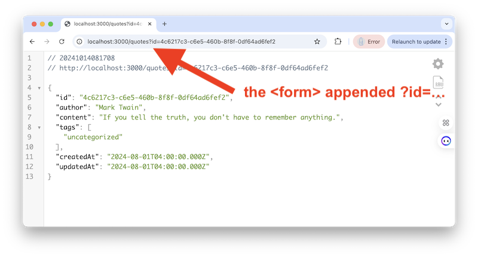

# 16 - "Old School" `<form>`s

- So far this semester, we have been using HTML forms in conjunction with client-side JavaScript to send data to our node server.
- But HTML forms have been around since the very beginning of the web, and can function in the web browser without utilizing *client-side* scripting
- Reference:
  - https://developer.mozilla.org/en-US/docs/Web/HTML/Element/form
  - https://www.w3schools.com/html/html_forms.asp

---

## I. A simple GET request

- Add the following to **admin.html**:

```html
<hr>

<h2>VII. View one quote (Old School GET, no JS)!</h2>
<form action="/quotes" method="GET">
  <label>Id: <input type="text" name="id" size="36"></label><br><br>
  <button type="submit">Send "No JS" Request to <kbd>/quotes?id=</kbd></button>
</form>

<p><i>This will re-direct the browser to the <kbd>/quotes?id=</kbd> endpoint, and display whatever the server sent back.</i></p>
<p>You can use <kbd>4c6217c3-c6e5-460b-8f8f-0df64ad6fef2</kbd> to view the mark Twain quote.</p>
```

- Note the `action` of the form, which is the URL it is going to call when the submit button is clicked
- Note the form `method` of `GET`, which means that the form will utlize the *query string* to send data to the node server
- PS - we are calling the `/quotes?id=xxx` endpoint here rather than `/api/hoot/xxx` because we don't already have query string handling with our `/api/hoot/xxx` endpoint

---

- Go ahead and paste an id to an actual quote into the field and click the "Send" button - it should call `/quotes?id=` and padd in the id you typed in - and you should see the following:



---

- Now try it with `4f19e53d-8b5b-40ab-ba72-cfbbcd2ce4f6` - you should see the JK Rowling quote
- Now try it with `12345` - you should see that an empty object is returned (because that's how we wrote the server side code for non-existent `id` values

---

- One more thing - add this line to the form HTML

```html
<input type="hidden" name="loggedin" value="true" />
```

- A `type="hidden"` input type can't be seen by the user, but is a way to pass form values to the server without the user having to type anything in
- Test the form again, the URL now includes a new value - `loggedin=true` - which BTW, our server will ignore:
  - `http://localhost:3000/quotes?id=12345&loggedin=true`
 
---

## II. Old School `POST`ing to the server
- Now let's go ahead and implement posting to the server "old school" style with no client-side JavaScript
- Here we'll go back to using the "hoots" API, and will call the existing `POST` `/api/addHoot` like we did so previously in the form (see  **II. Add a hoot!**), but this time WITHOUT using JS
- Here's the HTML you'll need - add this to **admin.html**:

```html
<hr>

<h2>VIII. Add a Hoot (Old School POST, no JS)!</h2>
<form action="/api/addHoot" method="POST">
  <label>Content: <input type="text" name="content" size="80"></label><br><br>
  <button type="submit">Send "No JS" Request to <kbd>/api/addHoot</kbd></button>
</form>

<p>This will call the existing <kbd>POST</kbd> <kbd>/api/addHoot</kbd> endpoint.</p>
<p>Unlike the <kbd>GET</kbd> above where the data (e.g. <kbd>/quotes?id=12345</kbd> is passed to the server via the <i>query string</i>, here the data will be passed to the server-side script in a <i>separate file.</i></p>
```

- Now add some new hoot text and try it out by clicking the "Send" button

---
---

| <-- Previous Unit | Home | Next Unit -->
| --- | --- | --- 
| [**15 -  Notes & Errata**](15-notes-and-errata.md)  |  [**IGME-430**](../) | TBA
