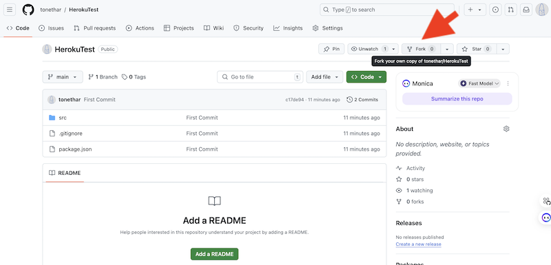
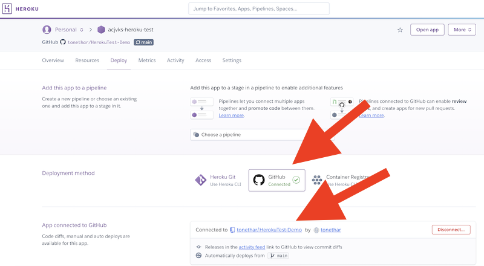
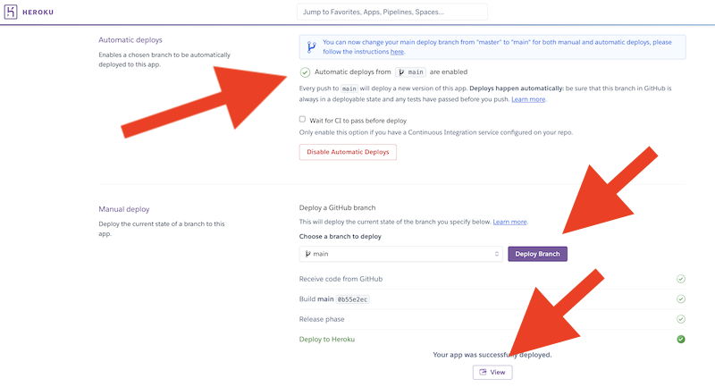
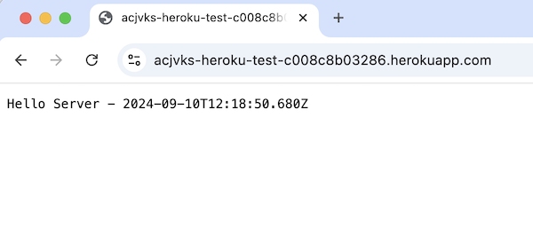
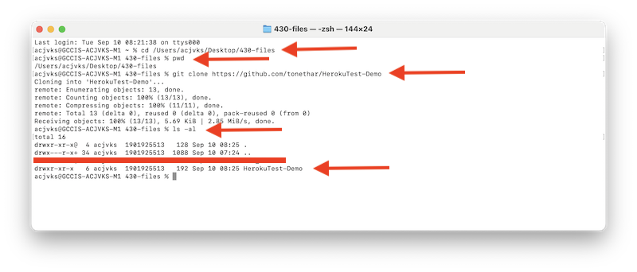
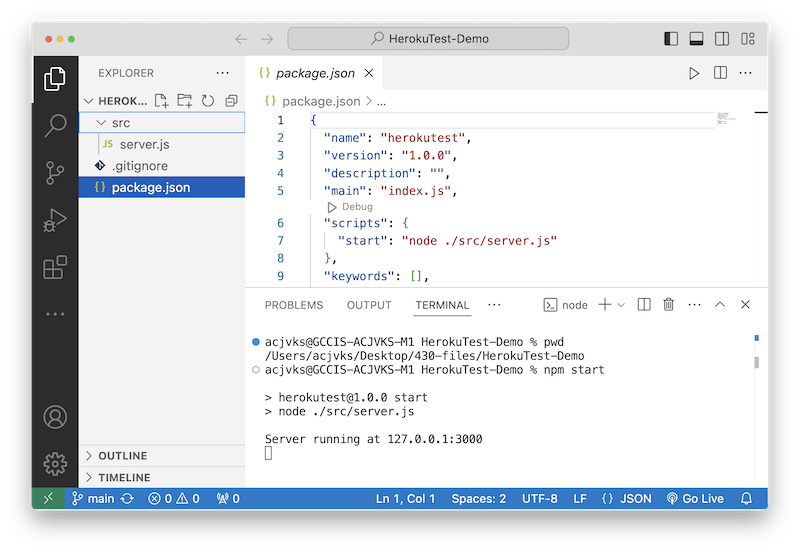
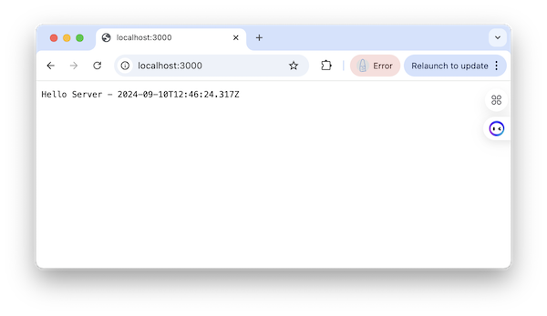
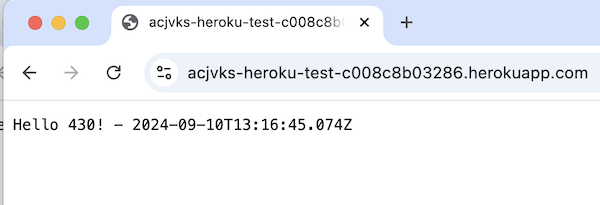

# 2 - Heroku Test

## I. Fork the test repository

- Head to https://github.com/tonethar/HerokuTest and **Fork** your own copy of it
  - keep the fork you made open in a web browser tab, or copy the URL for later
  - you don't need to clone to your desktop yet
- Look at the source code of your new repository - it is a simple web server that will echo "Hello!" to the browser
- Note the "start" script in **package.json** - this is what Heroku will run after it has downloaded all of the required packages from npm

**Forking HerokuTest Repo:**



---

## II. Pushing/Deploying to Heroku
- Follow the instructions in the "Pushing to Heroku" DOC, which is located in the myCourses *Content* Section, *Week-3*, *Guides & Links*
  - Name the app **abc1234-heroku-test** (where `abc1234` is your RIT id)
  - You can deploy your forked copy of “HerokuTest”

---





---

- Clicking the "View" button will launch the app in a web browser
  - copy the  browser link, you'll need it later when you submit this assignment

---



---

- If everything above works correctly, move on

---

## III. Clone your forked respository

- Now you need to clone your forked **HerokuTest** repository to your desktop
- If you don't already have something like this, create a folder on your PC named **430-files** or similar. Put it someplace easy to find
- Now open GitBash in that folder:
  - you might be able to right-click inside the folder to do so OR
  - you could open up a GitBash terminal window, then type `cd ` (`cd` followed by a space) and then drag drop the folder into the the terminal window, and then press enter
  - verify that your current working directory is **430-files** by typing `pwd`
- Clone your forked repository to the **430-files** folder:
  - type `git clone <clone-url-to-your-HerokuTest>`
- Verify that you have cloned the **HerokuTest** folder and files to your desktop

---



---

## IV. Run the HerokuTest project locally
- Quit GitBash
- Open the **HerokuTest** folder in VSCode ("Open Folder" in VSCode OR do a drag/drop)
- Open up the Terminal in VSCode:
  - verify you are in the correct folder by typing `pwd`
  - normally you would install the dependencies of a project by typing `npm i` - but this project is so simple it's not using any npm packages!
  - go ahead and type `npm start`, which runs the `"start"` script specified in **package.json**
 
---



---

- Head to `http://localhost:3000/` and verify that the project is running on your local machine
 
---



---

## V. Make some local edits, commit them, and push them to GitHub
- Shut down your node server by typing `control-c`
- Go ahead and edit **server.js**
  - change "Hello Server" to "Hello 430!"
  - save the file changes
  - type `npm start` again, head to `http://localhost:3000/`, and verify that your changes took
  - shut down your node server again by typing `control-c`
- Commit your changes to the local repository - you should hopefully aready know how to do this from the command line - but here's a reminder:
  - type `git status`
    - you should see something like `Changes not staged for commit: - modified:   src/server.js`
  - type `git add .` (which will "stage" all tracked files)
  - type `git status` again

```
On branch main
Your branch is up to date with 'origin/main'.

Changes to be committed:
  (use "git restore --staged <file>..." to unstage)
        modified:   src/server.js
```

- ***commit*** this changed file to your local repo by typing `git commit -m "Added 'Hello 430!'"`

```
Added 'Hello 430!'
1 file changed, 1 insertion(+), 1 deletion(-)
```

- ***push*** to your remote GitHub repo by typing `git push`

```
Enumerating objects: 7, done.
Counting objects: 100% (7/7), done.
Delta compression using up to 10 threads
Compressing objects: 100% (3/3), done.
Writing objects: 100% (4/4), 349 bytes | 349.00 KiB/s, done.
Total 4 (delta 2), reused 0 (delta 0), pack-reused 0
remote: Resolving deltas: 100% (2/2), completed with 2 local objects.
To https://github.com/tonethar/HerokuTest-Demo
0b55e2e..c951fc0  main -> main
```

---

## VI. Verify that your changes were pushed

- In your web browser, head to your forked repo on GitHub, and take a look at **server.js**, you should see the changes you made and an updated timestamp
- Now head to the browser link for your HerokuTest app - you should see that Heroku already knows about the changes to the repo, and has published the changes (assuming that you checked "Automatic deploys are enabled" when you set up the project in the Heroku control panel)

---



---

- Congratulations! You've now performed the "Continuous Delivery" part of **CI/CD**
  - we'll learn about the "Continuous Integration" part very soon

---

## VII. HW Submission
- Normally you would need to delete the **HerokuTest/node_modules** folder, but this project is so simple it doesn't have one
- ZIP up your **HerokuTest** folder
- Post it to the dropbox
- In the comments field:
  - give the link to your **HerokuTest** github repo
  - give the browser link for your HerokuTest app (see most recent screenshot above) - ***NOT your Heroku Dashboard link***

---
---

| <-- Previous Unit | Home | Next Unit -->
| --- | --- | --- 
| [**1 - Git & Heroku Setup**](1-git-and-heroku-setup.md)  |  [**IGME-430**](../) | ???

