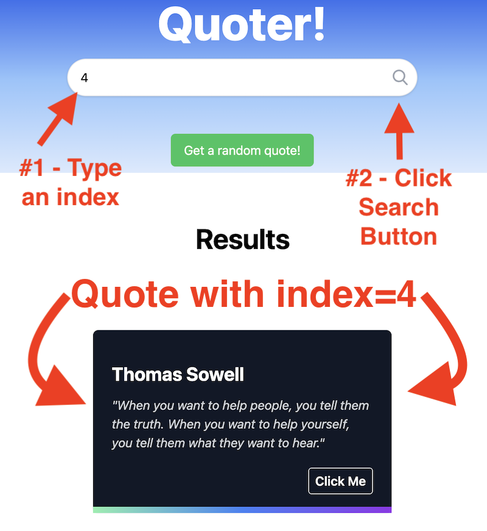

# 4 - Exploring HTTP methods with json-server

## I. Overview
- Rather than working with a web service that returns only a single quote, today we'll start working with a web service that has quote searching and filtering capabilities
- We will set this up with a new quotes data file ([**quotes-data-2.json.zip**](_files/quotes-data-2.json.zip)) AND
- the `json-server` npm package (https://www.npmjs.com/package/json-server), which will take this JSON file and construct a read/write API with it

---

## II. Overview of HTTP Messaging (Request & Response Phases)
- Source: https://www.rfc-editor.org/rfc/rfc9110#name-example-message-exchange

- The following example illustrates a typical HTTP/1.1 message exchange for a GET request (Section 9.3.1) on the URI `http://www.example.com/hello.txt`:

**Client *request:***

```
GET /hello.txt HTTP/1.1
User-Agent: curl/7.64.1
Host: www.example.com
Accept-Language: en, mi
```

**Server *response:***

```
HTTP/1.1 200 OK
Date: Mon, 27 Jul 2009 12:28:53 GMT
Server: Apache
Last-Modified: Wed, 22 Jul 2009 19:15:56 GMT
ETag: "34aa387-d-1568eb00"
Accept-Ranges: bytes
Content-Length: 51
Vary: Accept-Encoding
Content-Type: text/plain

Hello World! My content includes a trailing CRLF.
```

---
# HTTP Request Phase
---

### A. HTTP Methods
- Safe methods
- Idempotent Methods
- https://www.rfc-editor.org/rfc/rfc9110#section-9.3

### B. HTTP Request Headers


---
# HTTP Response Phase
---

### A. HTTP Status Codes
- https://www.rfc-editor.org/rfc/rfc9110#name-status-codes

### B. HTTP Response Headers

### C. The content (text, images, etc)

---
___

## III. json-server
- https://www.npmjs.com/package/json-server

1. Create a new folder named **quotes-server**

2. Inside of the **quotes-server** folder, create a **data** folder

3. Put the **quotes-data-2.json** file into the **quotes-server/data/** folder - here's the data file --> [**quotes-data-2.json.zip**](_files/quotes-data-2.json.zip)

4. Open up Gitbash (or Terminal on Mac) and make sure that the **quotes-server** folder is the *current working directory*

5. To create a boilerplate **package.json** file type `npm init -y`

6. To install the `json-server` package type `npm i json-server`

7. To run the server type `npx json-server quotes-data-2.json`

8. That's it - to test the GET endpoints of the server:

    - In a browser
      - http://localhost:3000/quotes will show all of the quotes
      - http://localhost:3000/quotes?index=0 will show the first quote, http://localhost:3000/quotes?index=1 will show the second quote and so on
    - From the command line, `curl http://localhost:3000/quotes` works (if you have `curl` installed)
    - You can also use Postman to test the endpoints
    - We don't have the random quote functionality here, but your quotes app JS code can point at and download a specific quote - go ahead an try that now (don't forget to run the quotes app off of live server) 

10. Summary of GET endpoints:

    - http://localhost:3000/version `will show value of version property`
    - http://localhost:3000/quotes `// will show all of the quotes`
    - http://localhost:3000/quotes?index=3 `// will show a quote that has an index value of 3`
    - http://localhost:3000/quotes/4c6217c3-c6e5-460b-8f8f-0df64ad6fef2 `will show a quote of id=4c6217c3-c6e5-460b-8f8f-0df64ad6fef2`
    - http://localhost:3000/quotes?id=4c6217c3-c6e5-460b-8f8f-0df64ad6fef2 `will do the same thing`
    - http://localhost:3000/quotes?index_gt=3 `an array of all quotes with an id greater than 3`
    - http://localhost:3000/quotes?index_lt=3 `an array of all quotes with an id less than 3`
    - http://localhost:3000/quotes?index_gte=3 `an array of all quotes with an id greater than or equal to 3`
    - http://localhost:3000/quotes?index_lte=3 `an array of all quotes with an id less than or equal to 3`
    - http://localhost:3000/quotes?index_ne=3 `an array of all quotes with an id not equal to 3`
    - http://localhost:3000/quotes?_start=1&_end=4 `a range of quotes in an array`
    - http://localhost:3000/quotes?_sort=author `sort array of results by author`
    - http://localhost:3000/quotes?tags[0]=fiction `array of quotes where the first tag is "fiction"`

11. To make your life a little easier:
    - reminder: you can quit the quotes-server code by typing `control-c`
    - in **package.json** replace the `"test"` key with the following - `"start": "npx json-server data/quotes-data-2.json"`
    - from the command line you can now type `npm run start` (or just `npm start`) to launch the server

12. Other stuff to know:
   - there is very little JS source code here, but the **node_modules** folder is huge!
     - whenever you submit a node project to myCourses ALWAYS delete the **node_modules** folder FIRST
     - and if you are going to save this yourself, you'll also want to delete the **node_modules** folder
     - if you are commiting this code to a repository, add **node_modules** to **.gitignore**
   - later on, if you want to run the project again, how do you get the **node_modules** back? Easy!
     - `cd` to the project folder and type `npm install` (or `npm i` for short) - npm will then look at the `"dependencies"` key in **package.json** and download the npm packages that are listed there
     - then type `npm start` to get json-server to serve up our JSON file

---

## IV. Discussion
- Note the 2 ways we are utilizing the url to pass data to our quotes web service:
  - with a *query string* AND
  - using the path to identify a resource (the quotes)
  - using query parameters to sort/filter those resources (quotes)
  - The above is called a "RESTful" API style - https://aws.amazon.com/what-is/restful-api/

---

## V. Exercises
- Duplicate the **quotes-app-2/** folder (the client quote app we've been working on) and name the copy **quotes-app-3/**
  - delete the **data/** folder and its contents (you will soon be getting your data from **quotes-server**
  - this time be sure to use `getJsonFetch()` (instead of `getJsonXHR`)`
- ***Task A)*** Easy! In **quotes-app-3/**, get the "Get a random quote!" button working with your locally running **quotes-server**:
  - the url to the local server will be `const jsonUrl = "http://localhost:3000/quotes";`
  - note that the **quotes-server** is running on port 3000, and Live Server has your **quotes-app-3/** running on port 5500 (or 5501 etc). For now, having them run in seperate VSCode windows is OK.
  - have it download ALL the quotes as an array, and then pick a random quote from that array and display it (an inefficient and sloppy way to do it, but it's OK this time)
- ***Task B***) Get the search box working:
  - The user will be able to type in a quote `index` and view that specific quote
  - Review the quotes endpoints above - one of these will fetch a quote by its `index` value
  - This time make sure that only the single matching quote is downloaded from the server, NOT the entire array!
  - ***One issue you will run into -*** `btn-search` (the "?" button in the text input) is inside of an HTML `<form>` tag. Clicking the button will cause the browser to "submit" the form, which reloads the HTML page, which will wipe out any changes you have made to the DOM (ex. displaying a quote). You will need to disable this default "submit" behavior of the `<form>`. Here is the starting code for the `btn-search` button:
 
```js
// don't forget to declare and initialize btnSearch
btnSearch.onclick = (evt) => {
  // <form>, don't submit!
  evt.preventDefault();
  // now grab the `.value` of #input-term
  // now build the URL to fetch that specific quote
  // now call `getJsonFetch()`
  ...
}
```

- ***Optional***: Get some error handling working - if the service returns an empty array (because there is no match for the requested `index`) display a message to the user

- ***Submnission***:
  - ZIP up and post your **quotes-app-3/** folder to the myCOurses dropbox
  - Don't worry about posting **quotes-server/** - I will test the client app with my version of the server
  - Don't worry about posting anything to banjo - it won;t work anyway because **quotes-server/** is only running locally

---

### Screenshot of Search Functionality

PS -  ... the "Get a random quote!" button still needs to work ...



---

## VI. Reference
- https://developer.mozilla.org/en-US/docs/Web/HTTP/Resources_and_specifications
- HTTP Protocol Specifications:
  - HTTP/1.0 - https://www.w3.org/Protocols/HTTP/1.0/draft-ietf-http-v10-spec-01.html
  - HTTP/1.1 - https://www.ietf.org/rfc/rfc2616.txt
  - HTTP/1.1 (Current Spec) - https://www.rfc-editor.org/rfc/rfc9110
- API Design:
  - [430 API Design Notes](../concepts/api-design.md)
 

---

## VII. Next Time
- More HTTP methods for Creating, Updating and Deleting quotes:
  - `POST`
  - `PUT` 
  - `PATCH`
  - `DELETE`

---
---

| <-- Previous Unit | Home | Next Unit -->
| --- | --- | --- 
| [**3 - Web services & Query Strings**](3-web-service-query-string.md)  |  [**IGME-430**](../) | TBA
