# Read/Update/Delete with `json-server`

---

## Overview

[I. CRUD](#i-crud)

[II. CRUD & HTTP Methods](#ii-crud--http-methods-aka-verbs-actions-etc)

[III. `GET` & `POST` Endpoints](#iii-get--post-endpoints)

[IV. `DELETE`](#iv-delete)

[V. `PATCH`](#v-patch)

[VI. `POST` in the browser with an HTML `<form>`](#vi-post-in-the-browser-with-an-html-form)

[VII. Homework](#vii-homework)
  
---

## I. CRUD
- Do you know about the CRUD acronym?
  - **C**reate
  - **R**ead
  - **U**pdate
  - **D**elete
- We are going to learn about how to implement all of these in HTTP, today!

---

## II. CRUD & HTTP Methods (aka "verbs", "actions", etc)
- **C**reate - `POST` (create a resource)
- **R**ead - `GET`
- **U**pdate - `PUT` (usually used to completely replace resource), `PATCH` (partially update a resource)
- **D**elete - `DELETE`

---

## III. `GET` & `POST` Endpoints
### `GET`
- we covered these [last time](4-http-methods-with-json-server.md#GET-endpoints)

### `POST`
- Used to *create* a new resource
  - You can't do it from the Browser's *location box* (those are GET requests only)
  - You'll instead need to use an HTML `<form>` of `method="POST"` OR
  - You can use XHR or fetch() and set the request method to `POST`
  - You can use Postman!
    - `POST` http://localhost:3000/quotes
    - Under the request body tab, and with the "raw" radio button selected, add this JSON:

```json
{
  "index": null,
  "id": "80ba8ef9-f9a7-4459-a4a0-c1619ea7dafa",
  "author": "Oscad Wilder",
  "content": "The meaning of life is to party, hardy!",
  "tags": ["uncategorized"],
  "createdAt": null,
  "updatedAt": null
}
```

- Now click the "Send" button
  - You should get a response from the server, with a "201 Created" Status Code
 
---

**Before:**

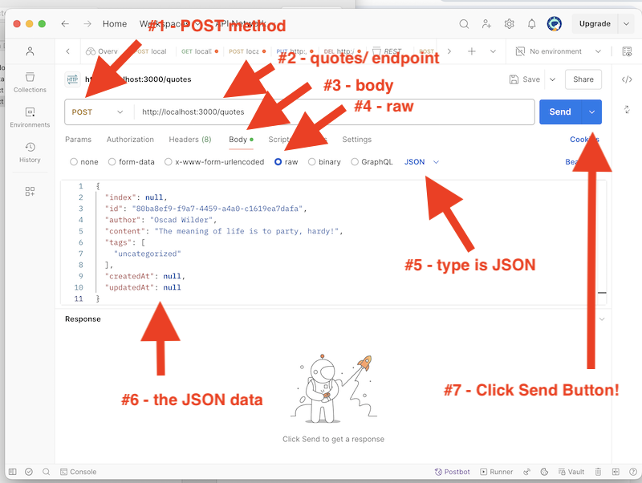


**After the server responds:**

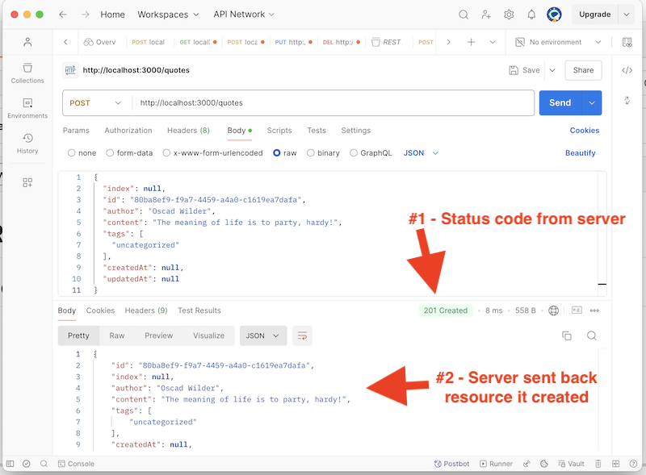

---

- Why did json-server send back the JSON object we created?
  - according to the specification about `POST` - *"If a resource has been created on the origin server, the response SHOULD be 201 (Created) and contain an entity which describes the status of the request and refers to the new resource..."*
- BTW - you can generate new UUID's in the browser with `crypto.randomUUID()`

### Did our POST request work?
- Check `GET` http://localhost:3000/quotes both in the browser and in Postman, and verify that the quote was created
- Open up the **quotes-data-2.json** file - you'll see that it has been updated and now contains the quote
- Fire up the **quotes-app-3/** client app and hit the "random" button a few times - at some point you should view the new quote

---

## IV. `DELETE`
- To delete a resource, we can pass in the `id`
  - the following will delete the Oscar Wilde quote:
  - `DELETE` `http://localhost:3000/quotes/4c951b60-1f90-41e7-a913-c1f454ff4c6e`

**Before:**

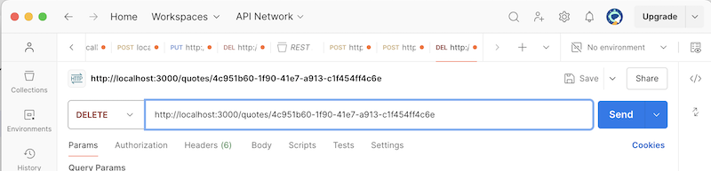

**After:**
- The server responds with a status code of `200 OK`
- The Oscar Wilde quote is GONE!
- Attempting to `DELETE` a resource that isn't there returns a `404 Not Found` status code

---

## V. `PATCH`

- Used to update existing resources
- You need to send over (just) the changes in the Body (like we did with `POST`), select "raw", and "JSON"
- `PATCH` `http://localhost:3000/quotes/7690718f-01b7-4775-9998-6a4adb480d27`
- Body text - `{"author": "Dr. Thomas Sowell"}`

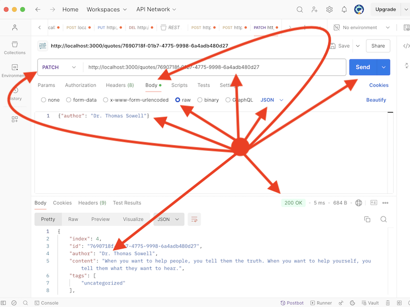

- In the example above, we added "Dr." to the beginning of Thomas Sowell's name. The server returned the updated resource.

---

## VI. `POST` in the browser with an HTML `<form>`

- Let's build an admin form to perform Create, Read, and Delete operations

### A. Here's the HTML

**quotes-admin-start.html**

```html
<!DOCTYPE html>
<html lang="en">
<head>
  <meta charset="UTF-8">
  <meta name="viewport" content="width=device-width, initial-scale=1.0">
  <title>Quotes Admin</title>
</head>
<body>
  <h1>Quotes Admin</h1>
  <h2>Add a Quote (POST)</h2>
  <!-- AI prompt - "I need an HTML form with content, author and id fields" -->
  <!-- Nice Reference: https://www.w3schools.com/html/html_forms.asp -->
  <form
    id="form-new-quote"
    action="http://localhost:3000/quotes" 
    method="POST" 
  >
    <label for="content">Quote:</label><br>
    <textarea id="content" name="content" rows="4" required></textarea><br><br>
    
    <label for="author">Author:</label><br>
    <input type="text" id="author" name="author" required><br><br>
    
    <label for="id">ID:</label><br>
    <input id="id" name="id" required size="38" readonly><br><br>
    
    <input type="submit" value="Submit">
</form>

  <hr>

  <h2>POST Results</h2>
  <div id="post-results">
    <p></p>
    <pre></pre>
  </div>

  <hr><hr>

  <h2>Delete Quote</h2>
  <button id="btn-delete">Delete</button> | <input id="delete-id" size="38"> 

  <h3>DELETE Results</h3>
  <div id="delete-results">
    <p></p>
    <pre></pre>
  </div>

  <hr><hr>

  <h2>View All Quotes</h2>
  <div id="all-quotes"></div>
  <script>
    // Code goes here!
  </script>
  </body>
  </html>
```

---

### B. Would you like some code?

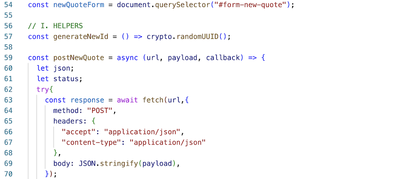

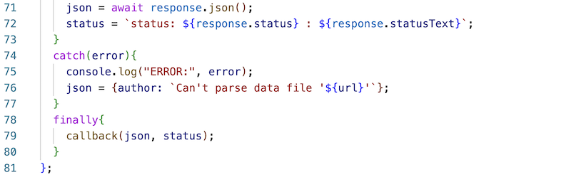

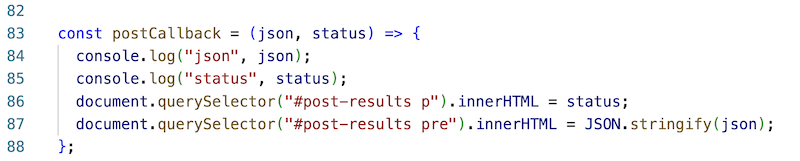

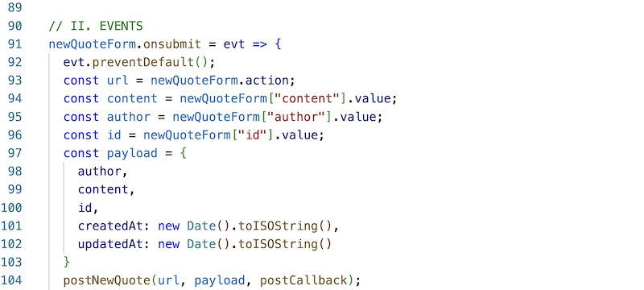

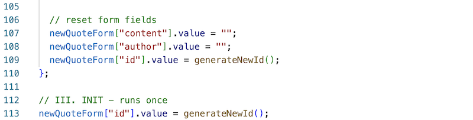

---

### C. Try it out

- Test it:
  - typing in a quote and author and clicking Submit should send over a new quote and give you a response of `201 Created`, and a copy of the new quote that was created
  - to verify that it was added, check the http://localhost:3000/quotes endpoint in Postman or the browser, or check the JSON file etc
  - try submitting the form without typing in an author name - the browser does *some* form validationfor us for free with the `required` attribute
  - note that here the quote `id`, `createdAt` and `updatedAt` values are generated on the *client*. But that's not the usual practice - we would usually let the server do this initialization, but using a bare-bones version of json-server means we don't have any way to do any server-side validation or initialization other than the default behavior

---

**Before:**

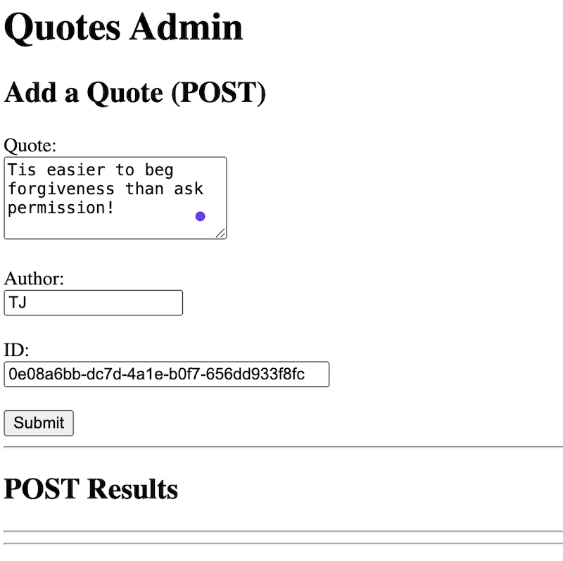

---

**After:**

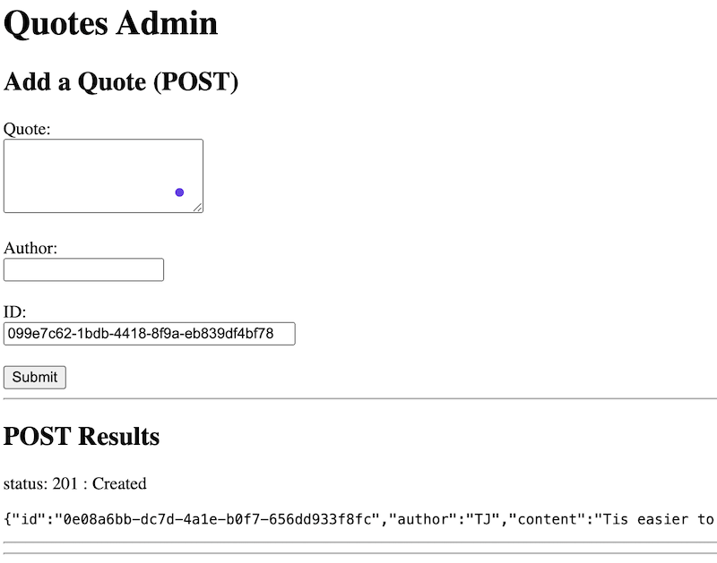

---

## VII. Homework

### A - Get the "View All Quotes" functionality working
- write a `showAllQuotes()` function
- the starter is below
- call this function when the page first loads AND whenever you have altered the list of quotes:
  - i) when a new quote has been successfully added
  - ii) when a quote has been deleted
- you will need to create `getJsonFetch()` (pretty much a copy/paste from last time)
- you will need to initialize the `allQuotesEndpoint` variable (easy and obvious)
- you will need to create  the `allQuotesCallback` function (take a look at the `postCallback` function to see what you need to do)

```js
const showAllQuotes = () => {
  getJsonFetch(allQuotesEndpoint, allQuotesCallback);
}
```

---

### B - Get the "Delete Quote" Functionality working

- write a `deleteQuote()` helper function - here's the signature:

```js
const deleteQuote = async (url, quoteId, callback) => {...}
```

- Here's the call to that function when the Delete button is clicked, and there's a quote id (the `deleteId` in the call below) in the `<input>`:

```js
deleteQuote(allQuotesEndpoint, deleteId, deleteCallback);
```

- you can reuse `allQuotesEndpoint`, and you'll need to create a `deleteCallback` function

---

### Screenshots

**A. View All Quotes**

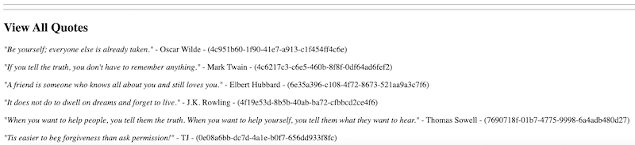

---

**B. Delete Quote**
- Successfully deleting a quote returns a `200 Ok` status code
- BTW - Attempting to delete a non-existent quote returns a 404 error

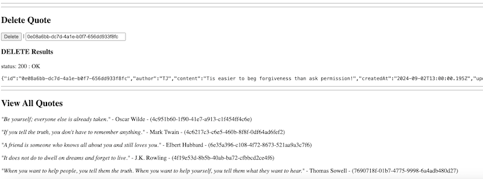

---
---

| <-- Previous Unit | Home | Next Unit -->
| --- | --- | --- 
| [**4 - Exploring HTTP methods with json-server**](4-http-methods-with-json-server.md)  |  [**IGME-430**](../) | TBA
