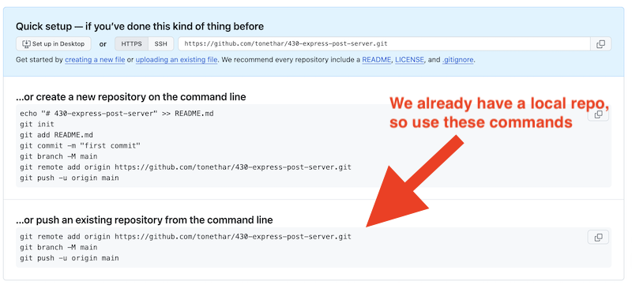

# 9 - `POST`ing data to express

- We have seen how to pass data to an express app with `GET` via URL params and URL routes ...
- now let's see how to send data to express via `POST`

## I. Get Started
- Duplicate the entire **router-app-passing-params** folder and re-name the copy to **router-app-POST**
  - you might want to delete the **node_modules** folder before you make the copy; if so, don't forget to `npm i` below
- Open up **router-app-POST** in VSCode and `npm i`,  `npm run dev`
- Verify that the app's endpoints still work in the browser

---

## II. Setting up a local Git repository
- It's about time to get this posted to Heroku, and to do that we'll need a Git repo
- In VSCode's Terminal, type `pwd` to make sure that your current working directory is **router-app-POST**
- Type `git init` to create a new git repository
  - in the console you should see `Initialized empty Git repository in ...`
  - BTW: if you type `ls -al` you'll see a **.git**  folder now - this is where the file changes you make are tracked
  - BTW: if you type `ls .git` you'll see its contents
  - BTW: never modify any of the files in the **.git** - pretty much just ignore it
- We need to tell git which files and folders to exclude from version tracking:
  - type `touch .gitignore` to create an empty text file named **.gitignore**
  - make **.gitignore** look like this:

**.gitignore**
```
node_modules
.DS_Store
```

- BTW: If you want a more exhaustive list of files for this **.gitignore** file, you can use GitHub's "Node" version of **.gitignore**, here it is (just be sure to add **.DS_Store** to the end of it) --> https://github.com/github/gitignore/blob/main/Node.gitignore
- Now let's get our local (currently empty) repo tracking our project files, and commit them:
  - `git status` - what's untracked?
  - `git add .` - add everything (except for what's in **.gitignore**
  - `git status` - shows what has been "staged" for a commit
  - `git commit -m "First commit"` - commits all staged files to local repo
  - `git status` - logs `"On branch main nothing to commit, working tree clean"`


---

## III. Creating a remote Git repository
- Let's go ahead and create a remote git repository on GitHub:
  - head to https://github.com/
  - click the "New" button
  - name it **430-express-post-server**
  - initialize the repo so that it is entirely *empty* - DO NOT check any boxes that create a README file, or a gitignore or a license file etc
  - you should see something like the following (but with values for your repo, not mine):

---



---

- To connect your local repo, to this remote repo we just created, type those last 3 lines above into the terminal in VSCode (and be sure that your current working directory is **router-app-POST**
- Which logs to the console:

```
Enumerating objects: 19, done.
Counting objects: 100% (19/19), done.
Delta compression using up to 10 threads
Compressing objects: 100% (17/17), done.
Writing objects: 100% (19/19), 173.30 KiB | 21.66 MiB/s, done.
Total 19 (delta 0), reused 0 (delta 0), pack-reused 0
To https://github.com/tonethar/430-express-post-server.git
 * [new branch]      main -> main
branch 'main' set up to track 'origin/main'.
```
- Type `git status` - which logs `On branch main Your branch is up to date with 'origin/main'. nothing to commit, working tree clean`
- In the web browser, reload your GitHub repo, you should see all of the files you just committed!

---

## IV. Set up an app on Heroku
- You should know how to do this
- Name the app **`<your-RIT-id>-430-express-post-server`**
- Hook up your **430-express-post-server** repo to the app
- Be sure to enable "Autodeploy" and CI - even though we don't yet have GitHUb Actions/continuous integration set up yet
- Push the repo
- Open the app and verify that **rich-client.html** and the other endpoints work
 
---
---

| <-- Previous Unit | Home | Next Unit -->
| --- | --- | --- 
| [**8 - Passing params to `express`**](8-passing-params-in-express.md)  |  [**IGME-430**](../) | ???
