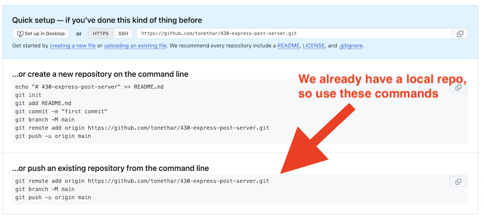
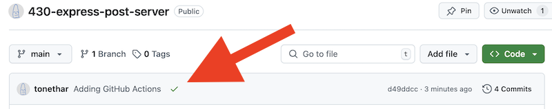

# 9 - Putting our project on Heroku

- Pretty soon, we'll be POSTing data to this app, and testing it on Heroku
- In this exercise, we'll first get everything running on Heroku

---

## I. Get Started
- Duplicate the entire **router-app-passing-params** folder and re-name the copy to **router-app-POST**
  - you might want to delete the **node_modules** folder before you make the copy; if so, don't forget to `npm i` below
- Open up **router-app-POST** in VSCode and `npm i`,  `npm run dev`
- Verify that the app's endpoints still work in the browser

---

## II. Setting up a local Git repository
- It's about time to get this posted to Heroku, and to do that we'll need a Git repo
- In VSCode's Terminal, type `pwd` to make sure that your current working directory is **router-app-POST**
- Type `git init` to create a new git repository
  - in the console you should see `Initialized empty Git repository in ...`
  - BTW: if you type `ls -al` you'll see a **.git**  folder now - this is where the file changes you make are tracked
  - BTW: if you type `ls .git` you'll see its contents
  - BTW: never modify any of the files in the **.git** folder - pretty much just ignore it!
- We need to tell git which files and folders to ***exclude*** from version tracking:
  - type `touch .gitignore` to create an empty text file named **.gitignore**
  - make **.gitignore** look like this:

**.gitignore**
```
node_modules
.DS_Store
```

- BTW: If you want a more exhaustive list of files for this **.gitignore** file, you can use GitHub's "Node" version of **.gitignore**, here it is (just be sure to add **.DS_Store** to the end of it) --> https://github.com/github/gitignore/blob/main/Node.gitignore
- Now let's get our local (currently empty) repo tracking our project files, and commit them:
  - `git status` - what's untracked?
  - `git add .` - add everything (except for what's in **.gitignore**
  - `git status` - shows what has been "staged" for a commit
  - `git commit -m "First commit"` - commits all staged files to local repo
  - `git status` - logs `"On branch main nothing to commit, working tree clean"`


---

## III. Creating a remote Git repository
- Let's go ahead and create a remote git repository on GitHub:
  - head to https://github.com/
  - click the "New" button and create a new, empty repository
  - name it **430-express-post-server**
  - initialize the repo so that it is entirely *empty* - DO NOT check any boxes that create a README file, or a gitignore or a license file etc
  - you should see something like the following (but with values for your repo, not mine):

---



---

- To connect your local repo to this remote repo we just created, type those last 3 lines above into the terminal in VSCode (and be sure that your current working directory is **router-app-POST**
- Which logs to the console:

```
Enumerating objects: 19, done.
Counting objects: 100% (19/19), done.
Delta compression using up to 10 threads
Compressing objects: 100% (17/17), done.
Writing objects: 100% (19/19), 173.30 KiB | 21.66 MiB/s, done.
Total 19 (delta 0), reused 0 (delta 0), pack-reused 0
To https://github.com/tonethar/430-express-post-server.git
 * [new branch]      main -> main
branch 'main' set up to track 'origin/main'.
```
- Type `git status` - which logs `On branch main Your branch is up to date with 'origin/main'. nothing to commit, working tree clean`
- In the web browser, reload your GitHub repo, you should see all of the files you just committed!

---

## IV. Set up an app on Heroku
- You should know how to do this
- Name the app **`<your-RIT-id>-430-express-post-server`**
- Hook up your **430-express-post-server** repo to the app
- Be sure to "Enable Automatic Deploys"
- DO NOT enable CI - we don't yet have GitHUb Actions/continuous integration set up
- Push the repo by clicking "Deploy Branch"
- Open the app and verify that **rich-client.html** and the other endpoints work
  - they don't! CRASH!!
 
---

## V. Fix the crash!
- To get a sense of what went wrong, in the dashboard, click the "More" button and choose "View logs"
  - in this case we know that something went wrong with `npm` - but the error messages aren't very specific ...
  - ... but I'll give you a hint, one issue is that we never created a `"start"` script for `npm` to run!
- Back in VSCode, open up **package.json**:
  - add the following script - `"start": "node src/app.js"`
  - save the file and type `npm start` to test it locally
  - quit the server with `ctrl-c`
- Also in VSCode, open **app.js**, now we need to let Heroku choose which `port` to use when it launches the server:
  - replace `const port = 3000;` ...
  - with `const port = process.env.PORT || process.env.NODE_PORT || 3000;`
  - `npm start` again, to test it locally
  - git add, git commit, git push etc to push the changes to GitHub
- Once everything is deployed, the app on Heroku should work!

---

## VI. GitHub Actions / Continuous Integration

- In VSCode's Terminal, type `pwd` to make sure that your current working directory is **router-app-POST**
- Create a **.github** folder
- Inside of the **.github** folder, create a **workflows** folder
- Inside of the **workflows** folder, create a **node.js.yml** file
- Make **node.js.yml** look like this:


**.github/workflows/node.js.yml**
```
# This workflow will do a clean installation of node dependencies, cache/restore them, build the source code and run tests across different versions of node
# For more information see: https://docs.github.com/en/actions/automating-builds-and-tests/building-and-testing-nodejs

name: Node.js CI

on:
  push:
    branches: [ "master", "main" ]
  pull_request:
    branches: [ "master", "main" ]

jobs:
  build:

    runs-on: ubuntu-latest

    strategy:
      matrix:
        node-version: [20.x]
        # See supported Node.js release schedule at https://nodejs.org/en/about/releases/

    steps:
    - uses: actions/checkout@v4
    - name: Use Node.js
      uses: actions/setup-node@v4
      with:
        node-version: '20.x'
    - run: npm ci
    - run: npm run build --if-present
    - run: npm test

```

- BTW - this is what `npm ci` does - https://docs.npmjs.com/cli/v10/commands/npm-ci
- Type `git status` - it should note that **.github/** isn't being tracked
- git add, git commit, git push etc to push the changes to GitHub
- Also, better do a `npm test` and verify that your code still passes!
- Head to the GitHub repo and look under the Actions tab - the **node.js.yml** script should run and succeed!
- You should also have that beautiful green checkmark showing on the main repo page

---



---

- Now head to Heroku's "Deploy" tab for your app and check the "Wait for CI to pass before deploy" box:
  - the next time you push a commit to your GitHub repo - `npm test` will run ...
  - ... and if the code passed it will then get pushed to Heroku
  - you might want to test that assumption now, by making a small change to the code locally and pushing it!
   
---
---

| <-- Previous Unit | Home | Next Unit -->
| --- | --- | --- 
| [**8 - Passing params to `express`**](8-passing-params-in-express.md)  |  [**IGME-430**](../) | 10 - POSTing data with express
