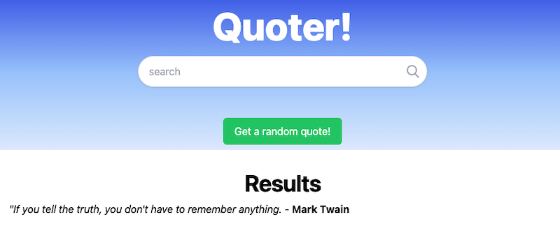

# XHR Review

## I. Overview

- As a way to review JS and the browser DOM, we'll build a simple app that displays a random quote loaded from a JSON file

---

## II. Start Files
- [quotes-app-start.zip](_files/quotes-app-start.zip)

---

## III. Instructions
GOAL: To get the basics of this working
1. **When the "Get a random quote!" button is clicked, show a quote and its author!**
    - the `id` of the button is `"btn-random"`
    - the `id` of the `
` where you can put the quote is `"content"`
    - the data file of quotes is located at `data/quotes-data.json`
    - use the `XMLHttpRequest` (aka `XHR`) object to download the JSON data
    - once the JSON file is loaded, use `JSON.parse()` to convert it to an object your code can parse
    - show both the `.content` and `.author` of the quote to the user by creating a `

` and inserting it into the content `
`

2. **Error Handling A** - if a "404" (file not found) .status code happens, log a message to the console and notify the user.
Test this by changing the value of `jsonUrl` to "data/quotes-dataXYZ.json"

3. **Error Handling B** - if the loaded file does not parse to legal JSON (signified by `JSON.parse()` throwing an exception), log the exact error message to the console and notify the user.
    - You will need to use a `try`/`catch`/`finally` block.
    - Test this by changing the value of `jsonUrl` to "data/quotes-data.csv" (CSV doesn't parse to JSON)

4. **Change the quote HTML** (the `
...
` tag) to instead use the "card" HTML (that is commented out in the HTML file)

---

## IV. N.B.

1. Here, xhr.open's first parameter is "GET" - which is an HTTP protocol *method*
    - In addition to `GET`, other HTTP methods (for creating, updating and deleting resources) that we will use in the course include `DELETE`, `HEAD`, `PATCH`, `POST` and `PUT`
2. Code style:
    - the "cool kids" pretty much exclusively use arrow functions these days
    - and template strings  (e.g. `Hello ${name}`) instead of string concatenation (e.g. "Hello " + name)
    - and destructured function parameters - try doing that somewhere
3. XHR has the ability to specify *request headers* (which are meta data about the request, and also a part of the HTTP protocol):
    - call `xhr.setRequestHeader(header, value)` AFTER `xhr.open()`
    - example (which tells the server "Send me JSON if you can!"): `xhr.setRequestHeader("Accept", "application/json")`
  
---

## V. Links
- `XHR`:
  - [`XMLHttpRequest`](https://developer.mozilla.org/en-US/docs/Web/API/XMLHttpRequest/)
  - [`XMLHttpRequest` example](https://flaviocopes.com/xhr/#an-example-xhr-request)
  - [`XMLHttpRequest.setRequestHeader()`](https://developer.mozilla.org/en-US/docs/Web/API/XMLHttpRequest/setRequestHeader)
- HTTP Protocol:
  - [HTTP Protocol Methods](https://developer.mozilla.org/en-US/docs/Web/HTTP/Methods)
  - [HTTP Protocol Request Headers - Accept Header](https://developer.mozilla.org/en-US/docs/Web/HTTP/Headers/Accept)
- JS:
  - [`JSON.parse()`](https://developer.mozilla.org/en-US/docs/Web/JavaScript/Reference/Global_Objects/JSON/parse)
  - [Arrow Functions](https://developer.mozilla.org/en-US/docs/Web/JavaScript/Reference/Functions/Arrow_functions)
  - [Destructuring Assignment](https://developer.mozilla.org/en-US/docs/Web/JavaScript/Reference/Operators/Destructuring_assignment)
  - [Paramter Destructuring](https://www.geeksforgeeks.org/parameter-destructuring/)
- Tailwind CSS:
  - https://tailwindcss.com/
  - https://tailwindflex.com/
  - https://kopi.dev/tailwind-css-with-cdn-html/
 
---

## VI. Screenshots

---

## VII. Coming Soon
- Refactor the app to talk to a web service (instead of a static JSON file)
- Refactor the app to send a *request header* to a server
- Refactor the app to use the `fetch()` API and promises instead of `XHR`
- Other improvements such as using `new Date()` to show when the quote was last updated
