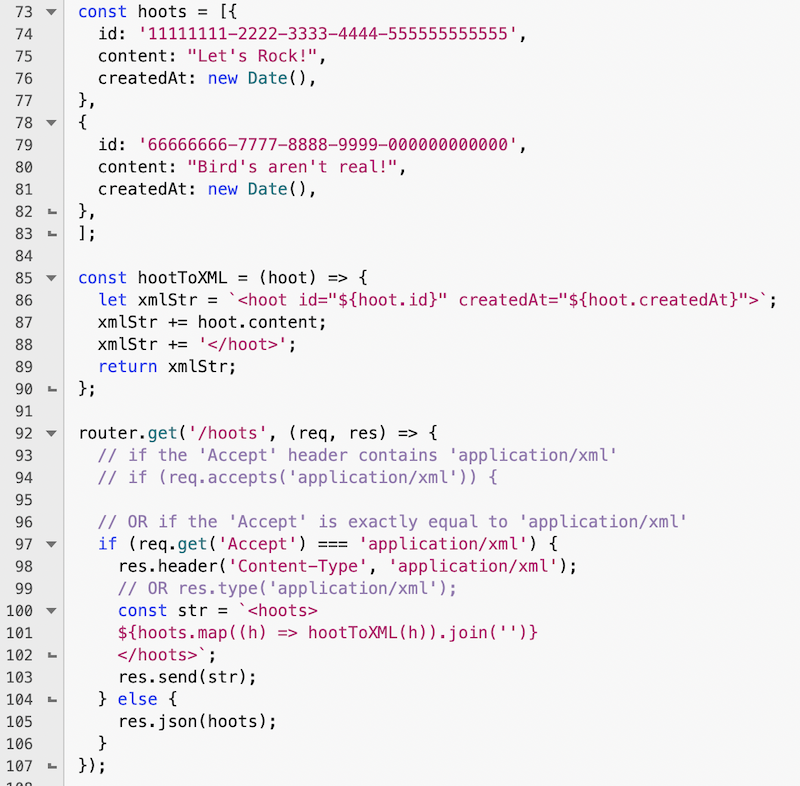
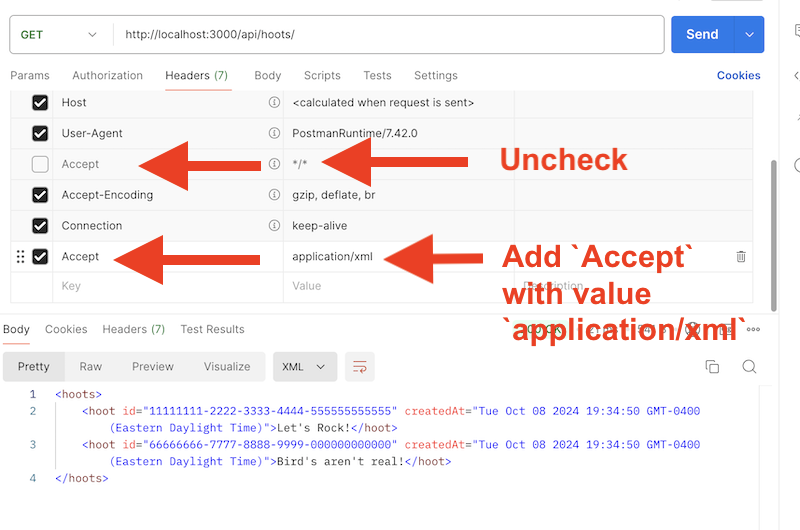

# `Accept` headers and XML


## I. What is XML?
- XML is a software- and hardware-independent tool for storing and transporting data.
  - XML stands for eXtensible Markup Language
  - XML is a markup language much like HTML
  - XML was designed to store and transport data
  - XML was designed to be self-descriptive
  - XML is a W3C Recommendation
- **Source:** https://www.w3schools.com/XML/xml_whatis.asp

---

## II. 3 Rules of XML
- Must Have a Root Element
- All Elements Must Have a Closing Tag
- Tags are Case Sensitive
- Elements Must be Properly Nested
- Attribute Values Must Always be Quoted
- Some characters have a special meaning in XML, and you must use an entity reference instead (e.g. `<` is represented by `&lt;`, `&` is represented by `&amp;`, and a few others)
- **Source:** https://www.w3schools.com/XML/xml_syntax.asp

---

## III. Simple Example

**apple.xml** could be any of the following:

```xml
<apple />
```

OR add some detail about the apple:

```xml
<apple>Red Delicious</apple>
```

OR add more detail:

```xml
<apple>
  <id>12345</id>
  <type>Red Delicious</type>
  <datePicked>Mon Oct 07 2024 07:29:57 GMT-0400 (Eastern Daylight Time)</datePicked>
</apple>
```

OR put the meta data in the *attributes*:

```xml
<apple id="12345" datePicked="Mon Oct 07 2024 07:29:57 GMT-0400 (Eastern Daylight Time)">
  <type>Red Delicious</type>
</apple>
```

Finally, an "array" of apples:

**fruit-basket.xml**
```xml
<fruitBasket>
  <apple id="12345" datePicked="Mon Oct 07 2024 07:29:57 GMT-0400 (Eastern Daylight Time)">
    <type>Red Delicious</type>
  </apple>
  <apple id="67890" datePicked="Mon Oct 07 2024 07:29:59 GMT-0400 (Eastern Daylight Time)">
    <type>Red Delicious</type>
  </apple>
</fruitBasket>
```

---

## IV. `hoots` as XML

Here are some possible representations of a hoot:

```xml
<hoot>
  <id>12345</id>
  <createdAt>Mon Oct 07 2024 07:29:57 GMT-0400 (Eastern Daylight Time)</createdAt>
  <content>Let's Rock!</content>
</hoot>
```

OR with the metadata as attributes:

```xml
<hoot id="12345" createdAt="Mon Oct 07 2024 07:29:57 GMT-0400 (Eastern Daylight Time)">
Let's Rock!
</hoot>
```

---

## V. Creating XML in code

- Here it is - and there is a lot to talk about here!



---

## VI. XML issues to watch out for

- If an `&` character is in any of your data, it will stop any further client-side parsing of the XML and give an error.
  - solution: either manually or with code replace all `&` with the entity reference `&amp;`
  - single quotes `'` are usually OK but ...
  - double quotes `"` are a problem - you can either escape them with a backslash `<hoot>\"No good deed goes unpunished!\"</hoot>` or with `&quot;`

  
---

## VII. Testing with Postman

- By default, Postman sends a "Accept any MIME type" header that looks like this `Accept: */*`
  - https://developer.mozilla.org/en-US/docs/Web/HTTP/Headers/Accept
- Which means we'll get JSON back from out server by default
- But because we want to test the XML capability we just added, we want to tell the server, "just send me XML!", which looks like this:
  - `Accept: application/xml`
- Go ahead and send this `Accept: application/xml` header using Postman, and you'll get the XML back - see below!



---

## VIII. Parsing XML on the client side

- Add the following to **admin.html**

```html
<hr>

<h2>VI. See all the hoots! (XML Version)</h2>
<p><button id="btn-all-hoots-xml">Fetch XML <kbd>/api/hoots</kbd></button></p>
<h3>Results:</h3>
<div id="output-all-hoots-xml">???</div>
```

- `XHR` already has a responseXML property, so it's pretty easy

```js

```

- But let's just keep using `fetch()`

```js

```

---

## IX. XML in Project 1

