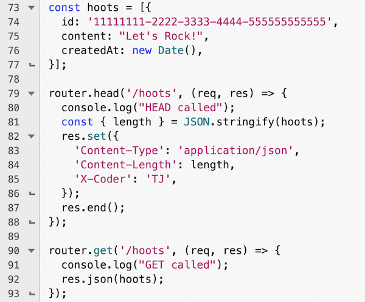

# Express and responding to `HEAD` requests

- Express handles a lot of repetive tasks for us! For example, `res.json(obj)` does the following for us
  - "stringifies" `obj`
  -  sends a status code of `200`
  -  sends a response header of `Content-Type: application/json`
  -  send the content
- AND if we send a `HEAD` request to an already implemented `GET` route, it will:
  - send the `Content-Type: application/json`
  - send the `Content-Length` of the stringified `obj` in *bytes*
  - NOT send the actual content (i.e. the stringified `obj`)
- However, for Project 1 we want you to know how to respond to HEAD requests without relying on express "magic"

---

## I. HTTP `HEAD` request method
- https://developer.mozilla.org/en-US/docs/Web/HTTP/Methods/HEAD
  - *"The `HEAD` HTTP method requests the metadata of a resource in the form of headers that the server would have sent if the `GET` method was used instead."*
  - *"This method can be used in cases where a URL might produce a large download, for example, a `HEAD` request can read the `Content-Length` header to check the file size before downloading the file with a `GET`".*

---

## II. express and `app.head()` (or `router.head()`)
- https://expressjs.com/en/5x/api.html#app.METHOD
  - *"The `app.get()` function is automatically called for the HTTP `HEAD` method in addition to the `GET` method if `app.head()` was not called for the path before `app.get(`)."*

---

- ***Meaning, put the `app.head()` code BEFORE the `app.get()` code ...***

---

## III. "Hoots" Example

**app/routes/api.js**

- Note: replace `X-Coder: TJ` with `X-Coder: <your-actual-initials>`
- EDIT: replace line 81 with:
  - `const length = Buffer.byteLength(JSON.stringify(hoots), 'utf8');`
  - ... in this instance, both lines will return the same number ...
  - ... but `Buffer.byteLength()` will work properly with multi-byte encoded strings

---

## IV. Test it
- `GET` in browser or Postman - http://localhost:3000/api/hoots
  - You will see the content and all of the default headers that express sends
- `HEAD` in Postman - http://localhost:3000/api/hoots
  - You will NOT see the content, and will also see the `Content-Type`, `Content-Length` and `X-<your-actual-initials>`

---

## V. Reference
- https://stackoverflow.com/questions/27025486/express-js-multiple-methods
