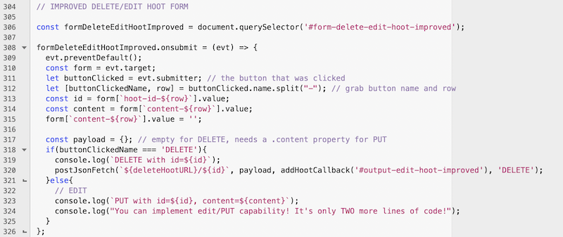

# Improved admin `<form>`


## I. How should your Project-1 admin form function?
- [Project-1's admin.html](./project-1.md#v-g-adminhtml)
- `DELETE`ing and `PUT`-ing needs to be easier for ther admin then what we did on the hoots exercise
  - the admin must NEVER have to copy/paste a resource `id` in order to edit or delete a resource
 
---

## II. Improved Delete/Edit form - the HTML & CSS
- You need to make some changes to **admin.html**
- Here's the CSS - put this in the `<style>` tag:
  
```css
.table { display: table; border:1px solid black; } 
.table .row { display: table-row; }
.table .row>* {
  display: table-cell;
  border: 1px solid red; padding:10px; background-color: beige;
}
```

---

- Here's the HTML, put this at the end of the `<body>` tag

```html
<hr>

<h2>IX. Delete or Edit all the hoots (IMPROVED)!</h2>
<form id="form-delete-edit-hoot-improved" class="table">
  <!-- row #0 -->
  <div class="row">
    <span class="row-id">id: 11111111-2222-3333-4444-555555555555</span>
    <input type="hidden" name="hoot-id-0" value="11111111-2222-3333-4444-555555555555">
    <label><b>Content:</b> <input type="text" name="content-0" size="30" value="Let's Rock!"></label>
    <button type="submit" name="UPDATE-0">UPDATE</button>
    <button type="submit" name="DELETE-0">DELETE</button> 
  </div>

   <!-- row #1 -->
   <div class="row">
    <span class="row-id">id: 66666666-7777-8888-9999-000000000000</span>
    <input type="hidden" name="hoot-id-1" value="66666666-7777-8888-9999-000000000000">
    <label><b>Content:</b> <input type="text" name="content-1" size="30" value="Bird's aren't real!"></label>
    <button type="submit" name="UPDATE-1">UPDATE</button>
    <button type="submit" name="DELETE-1">DELETE</button> 
  </div>

  <!-- etc for row #2 and beyond -->
  <!-- you will need to generate this entire form and all its rows dynamically, with JS! -->
</form>
<h3>Results:</h3>
<div id="output-edit-hoot-improved">???</div>
```

---

- And here's the JavaScript:



---

