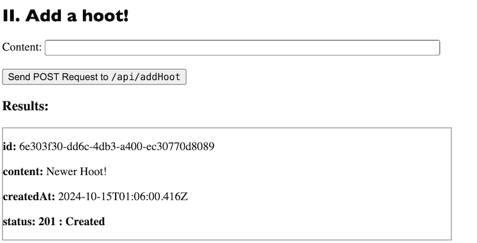
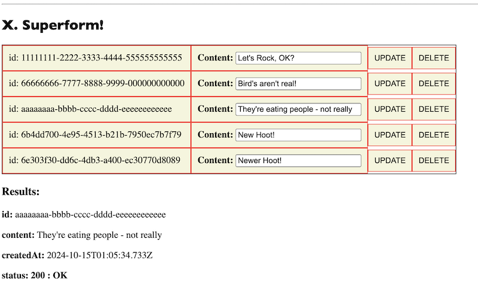
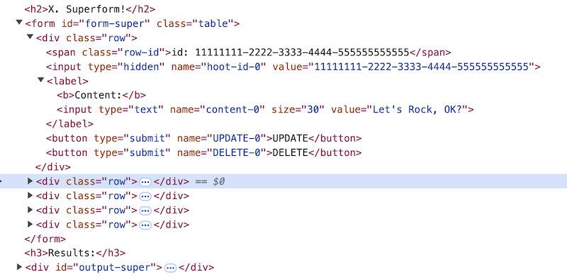

# Improved admin `<form>`


## I. How should your Project-1 admin form function?
- [Project-1's admin.html](./project-1.md#v-g-adminhtml)
- `DELETE`ing and `PUT`-ing needs to be easier for ther admin then what we did on the hoots exercise
  - the admin must NEVER have to copy/paste a resource `id` in order to edit or delete a resource
 
---

## II. Improved Delete/Edit form - the HTML & CSS
- You need to make some changes to **admin.html**
- Here's the CSS - put this in the `<style>` tag:
  
```css
.table { display: table; border:1px solid black; } 
.table .row { display: table-row; }
.table .row>* {
  display: table-cell;
  border: 1px solid red; padding:10px; background-color: beige;
}

/* https://wisdmlabs.com/blog/responsive-tables-using-css-div-tag/ */
```

---

- Here's the HTML, put this at the end of the `<body>` tag:

```html
<hr>

<h2>IX. Delete or Edit all the hoots (IMPROVED)!</h2>
<form id="form-delete-edit-hoot-improved" class="table">
  <!-- row #0 -->
  <div class="row">
    <span class="row-id">id: 11111111-2222-3333-4444-555555555555</span>
    <input type="hidden" name="hoot-id-0" value="11111111-2222-3333-4444-555555555555">
    <label><b>Content:</b> <input type="text" name="content-0" size="30" value="Let's Rock!"></label>
    <button type="submit" name="UPDATE-0">UPDATE</button>
    <button type="submit" name="DELETE-0">DELETE</button> 
  </div>

   <!-- row #1 -->
   <div class="row">
    <span class="row-id">id: 66666666-7777-8888-9999-000000000000</span>
    <input type="hidden" name="hoot-id-1" value="66666666-7777-8888-9999-000000000000">
    <label><b>Content:</b> <input type="text" name="content-1" size="30" value="Bird's aren't real!"></label>
    <button type="submit" name="UPDATE-1">UPDATE</button>
    <button type="submit" name="DELETE-1">DELETE</button> 
  </div>

  <!-- etc for row #2 and beyond -->
  <!-- you will need to generate this entire form and all its rows dynamically, with JS! -->
</form>
<h3>Results:</h3>
<div id="output-edit-hoot-improved">???</div>
```

---

## III. Improved Delete/Edit form - the JavaScript

- And here's the JavaScript:


---

- PS - here's the hoot data I'm using - put it in **api.js**

```js
const hoots = [{
  id: '11111111-2222-3333-4444-555555555555',
  content: "Let's Rock!",
  createdAt: new Date(),
 },
 {
  id: '66666666-7777-8888-9999-000000000000',
  content: "Bird's aren't real!",
  createdAt: new Date(),
 },
];
```

---

## IV. Discussion: How does it work?
- Let's be sure that we understand EVERY line of code
- BTW:
  - would having separate `.onclick` event handlers for the UPDATE and DELETE buttons be easier than a single `.onsubmit` on the entire form?

---

## V. Project 1
- *What do you need to do to this to finish it up for [Project 1](project-1.md)?*
- Rather than 2 hard-coded Hoots, you need to show ALL of your current resources in a "Superform" (see screenshot below)
  - you might have a large number of resources (100's?), so the maximum you must show at any one time on the admin page is 50
  - a nice (but optional) feature for this form would be *paging* capabilities so that the user could cycle through ALL of your resources
  - when a resource is added, deleted, or updated -  the superform immediately updates to show the changes
  - BTW: nobody else calls this kind of form a "superform" - we're only calling it this to distinguish it from our earlier "lame" form that made the admin copy/paste id values


### V-A. Screenshots

---



---



---



---

## VI. Hints

---

- Here's the HTML for your delete/edit "superform":

```html
<h2>X. Superform!</h2>
<form id="form-super" class="table"></form>

<h3>Results:</h3>
<div id="output-super">???</div>
```

---

- Here's some JS to start you off:

```js
const superForm = document.querySelector('#form-super');
superForm.onsubmit = deleteEditCB;

// call populateSuperForm() when the page first loads, and whenever your server data changes (from DELETE, POST, PUT) 
const populateSuperForm = () => {
  superForm.innerHTML = '';

  // callback function for when data shows up
  const buildSuperFormCB = (json) => superForm.innerHTML = json.map(...
  // build each row of the form
  // ditto
  ).join('');

  
  getJsonFetch(allHootsURL, buildSuperFormCB);
};

// populate initial state of form
populateSuperForm();
```

---
