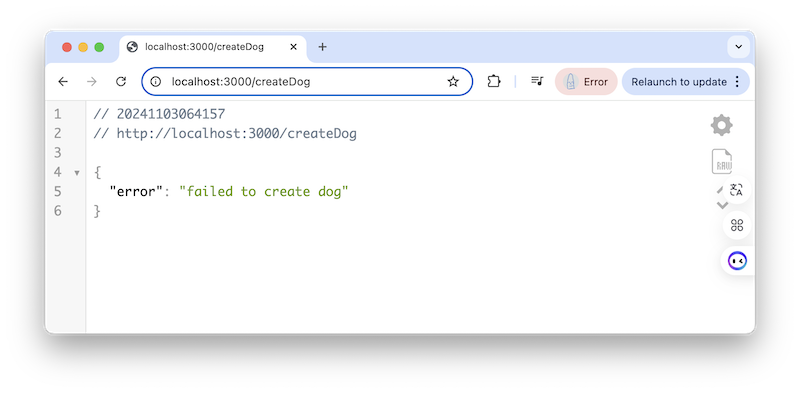

# Week 11A

## I. Review MongoDB HW
- [HW - MongoDB - Intro to mongo shell](https://github.com/tonethar/IGME-430-Spring-2020/blob/master/notes/mongo-shell-intro.md)
  - Covered the CRUD operations of MongoDB

---

## II. Continue `mongoose` walkthrough
- https://mongoosejs.com/
- https://www.npmjs.com/package/mongoose
- Simple-MVC-Example:
  - Walkthough --> [YouTube: Week 8.2 Simple MVC - Models](https://www.youtube.com/watch?v=2DgCCVpRRbM)
    - note that unlike what the video is doing, you do not need to install a local version of MongoDB, and can solely use a MongoDB cloud database
    - also note that some of the code in the video is deprecated, and the correct code is in "done" version linked below, and in the *9.2 Simple MVC Example.docx* file in myCourses
  - Start Code --> [Simple-MVC-Example](https://github.com/IGM-RichMedia-at-RIT/Simple-MVC-Example) - just `git clone` or download the ZIP and `npm i` / `npm run nodemon`, you don't need to fork this repo
  - "Done" Code --> [Simple-MVC-Example - Commented "Done" Code](https://github.com/IGM-RichMedia-at-RIT/simple-mvc-example-done)
- Links:
  - https://mongoosejs.com/docs/api/query.html#Query.prototype.find()
  - https://mongoosejs.com/docs/api/query.html#Query.prototype.findOne()
  - https://www.mongodb.com/docs/manual/reference/method/db.collection.findOne/
  - https://mongoosejs.com/docs/api/query.html#Query.prototype.findOneAndUpdate()
  - https://mongoosejs.com/docs/tutorials/findoneandupdate.html
  - https://mongodb.github.io/node-mongodb-native/4.9/classes/Collection.html#findOneAndUpdate
---

## III. SimpleModels HW
- Worth 2 HW assignments
- For "start" code, it uses the "Done" version of *Simple-MVC-Example* above
- Tips:
  - I named my `POST` endpoint `/createDog` and my `GET` endpoint `/findDogAndAge` (but you can name them whatever you want)
  - You will also need to implement `/page4`, which is pretty much just the `Dog` version of `/page1`
  - Important --> `Model.find()`, `Model.findOne()`, and `Model.findOneAndUpdate()` each return a `doc` if they find a match, and `undefined` if they do not
- Extra requirement, not listed in PDF:
  - add navigation element for page4, to all 5 pages, see screenshots below:

---

### `GET` `/page3` - add a new dog

---

### `POST` `/createDog` - ERROR - provided dog name already existed
- If you check the console in VSCode , you'll see `E11000 duplicate key error collection: simpleModelsHW.dogs index: name_1 dup key: { name: "Waggers" }`

---

### `POST` `/createDog` - success

---

### `GET` `/findDogAndAge` - success

---

### `GET` `/findDogAndAge` - ERROR

---

### `GET` `/page4` - view all dogs

---
---

| <-- Previous Unit | Home | Next Unit -->
| --- | --- | --- 
|   [**Week 10B Notes**](10B.md)  |  [**IGME-430 Home**](../) | [**Week 11B Notes**](11B.md)
